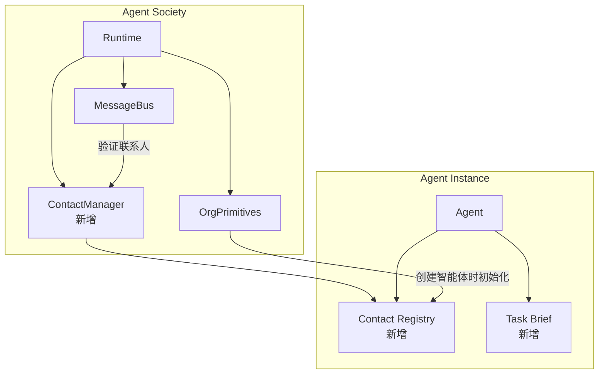
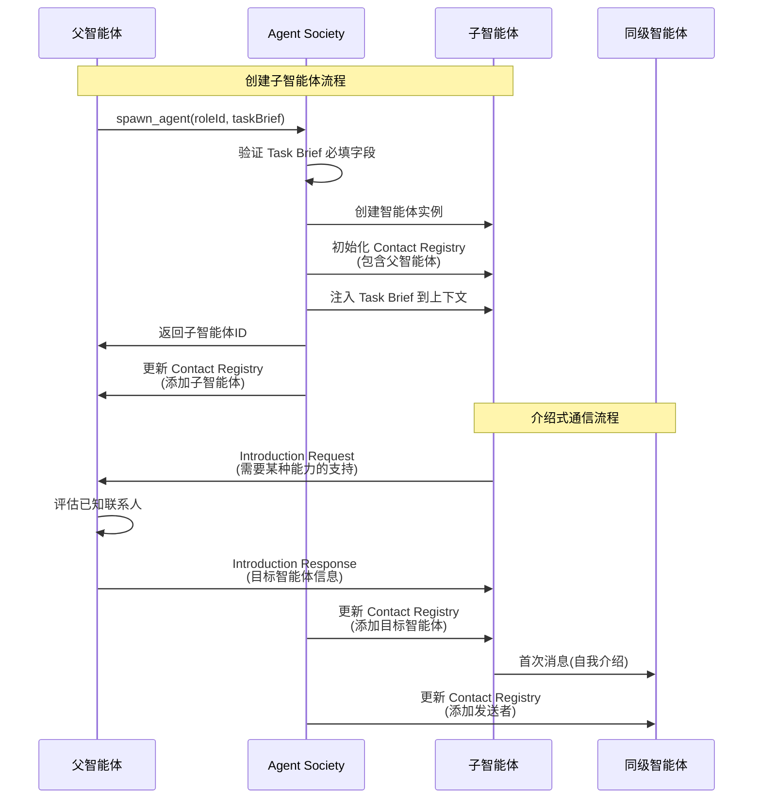

# Design Document: Agent Communication Protocol

## Overview

本设计文档描述智能体通信协议的改进方案，解决当前系统中智能体之间信息传递不充分的问题。核心改进包括：

1. **任务委托书（Task Brief）** - 结构化的任务说明，确保子智能体获得完整的任务上下文
2. **联系人注册表（Contact Registry）** - 每个智能体维护的已知联系人列表，限制通信范围
3. **介绍式通信机制** - 通过已认识的智能体获取新联系人
4. **消息格式规范化** - 统一的消息格式，包含明确的来源标识

## Architecture

### 系统架构图



### 通信流程图



## Components and Interfaces

### 1. ContactManager（新增组件）

负责管理所有智能体的联系人注册表。

```javascript
class ContactManager {
  constructor(options) {
    this._registries = new Map(); // agentId -> ContactRegistry
    this.log = options.logger;
  }
  
  /**
   * 为智能体初始化联系人注册表
   * @param {string} agentId - 智能体ID
   * @param {string} parentAgentId - 父智能体ID
   * @param {Array} collaborators - 预设协作者列表
   */
  initRegistry(agentId, parentAgentId, collaborators = []) {
    const registry = new Map();
    
    // 添加父智能体（root 和 user 特殊处理）
    if (agentId === 'root') {
      registry.set('user', { id: 'user', role: 'user', source: 'system' });
    } else if (agentId === 'user') {
      registry.set('root', { id: 'root', role: 'root', source: 'system' });
    } else if (parentAgentId) {
      registry.set(parentAgentId, { 
        id: parentAgentId, 
        role: this._getAgentRole(parentAgentId),
        source: 'parent' 
      });
    }
    
    // 添加预设协作者
    for (const collab of collaborators) {
      registry.set(collab.agentId, {
        id: collab.agentId,
        role: collab.role,
        interfaceSpec: collab.interfaceSpec,
        source: 'preset'
      });
    }
    
    this._registries.set(agentId, registry);
  }
  
  /**
   * 检查联系人是否在注册表中（仅用于查询，不用于发送验证）
   * @param {string} fromAgentId - 发送者ID
   * @param {string} toAgentId - 接收者ID
   * @returns {{inRegistry: boolean, error?: string}}
   */
  isContactKnown(fromAgentId, toAgentId) {
    const registry = this._registries.get(fromAgentId);
    if (!registry) {
      return { inRegistry: false, error: 'sender_not_found' };
    }
    if (!registry.has(toAgentId)) {
      return { inRegistry: false, error: 'unknown_contact' };
    }
    return { inRegistry: true };
  }
  
  /**
   * 添加联系人
   * @param {string} agentId - 智能体ID
   * @param {Object} contact - 联系人信息
   */
  addContact(agentId, contact) {
    const registry = this._registries.get(agentId);
    if (registry) {
      registry.set(contact.id, contact);
    }
  }
  
  /**
   * 获取联系人信息
   * @param {string} agentId - 智能体ID
   * @param {string} contactId - 联系人ID
   * @returns {Object|null}
   */
  getContact(agentId, contactId) {
    const registry = this._registries.get(agentId);
    return registry?.get(contactId) ?? null;
  }
  
  /**
   * 列出所有联系人
   * @param {string} agentId - 智能体ID
   * @returns {Array}
   */
  listContacts(agentId) {
    const registry = this._registries.get(agentId);
    return registry ? Array.from(registry.values()) : [];
  }
}
```

### 2. TaskBrief 数据结构

```javascript
/**
 * Task Brief 数据结构
 * @typedef {Object} TaskBrief
 * @property {string} objective - 目标描述（必填）
 * @property {string[]} constraints - 技术约束（必填）
 * @property {string} inputs - 输入说明（必填）
 * @property {string} outputs - 输出要求（必填）
 * @property {string} completion_criteria - 完成标准（必填）
 * @property {Collaborator[]} [collaborators] - 协作联系人（可选）
 * @property {string[]} [references] - 参考资料（可选）
 * @property {string} [priority] - 优先级（可选）
 */

/**
 * 协作者信息
 * @typedef {Object} Collaborator
 * @property {string} agentId - 智能体ID
 * @property {string} role - 角色描述
 * @property {string} description - 协作说明
 * @property {InterfaceSpec} [interfaceSpec] - 接口规格
 */

/**
 * 接口规格说明
 * @typedef {Object} InterfaceSpec
 * @property {string} services - 服务描述
 * @property {string} input_format - 输入格式
 * @property {string} output_format - 输出格式
 * @property {string[]} [examples] - 使用示例
 */

/**
 * 验证 Task Brief 必填字段
 * @param {TaskBrief} taskBrief
 * @returns {{valid: boolean, errors: string[]}}
 */
function validateTaskBrief(taskBrief) {
  const errors = [];
  const required = ['objective', 'constraints', 'inputs', 'outputs', 'completion_criteria'];
  
  for (const field of required) {
    if (!taskBrief || taskBrief[field] === undefined || taskBrief[field] === null) {
      errors.push(`缺少必填字段: ${field}`);
    }
  }
  
  if (taskBrief?.constraints && !Array.isArray(taskBrief.constraints)) {
    errors.push('constraints 必须是数组');
  }
  
  return { valid: errors.length === 0, errors };
}
```

### 3. 消息格式化器

```javascript
/**
 * 格式化消息以呈现给智能体
 * @param {Object} message - 原始消息
 * @param {Object} senderInfo - 发送者信息
 * @returns {string} 格式化后的消息文本
 */
function formatMessageForAgent(message, senderInfo) {
  const { from, payload } = message;
  const senderRole = senderInfo?.role ?? 'unknown';
  
  let header;
  if (from === 'user') {
    header = '【来自用户的消息】';
  } else {
    header = `【来自 ${senderRole}（${from}）的消息】`;
  }
  
  const content = typeof payload === 'object' 
    ? (payload.text ?? JSON.stringify(payload))
    : String(payload);
  
  const replyHint = from !== 'user' 
    ? `\n如需回复，请使用 send_message(to='${from}', ...)`
    : '';
  
  return `${header}\n${content}${replyHint}`;
}
```

### 4. spawn_agent 工具增强

```javascript
// 更新 spawn_agent 工具定义
{
  type: "function",
  function: {
    name: "spawn_agent",
    description: "在指定岗位上创建智能体实例，必须提供任务委托书（Task Brief）。",
    parameters: {
      type: "object",
      properties: {
        roleId: { type: "string", description: "岗位ID" },
        taskBrief: {
          type: "object",
          description: "任务委托书，包含任务的完整说明",
          properties: {
            objective: { type: "string", description: "目标描述" },
            constraints: { 
              type: "array", 
              items: { type: "string" },
              description: "技术约束（如：使用HTML+JS、Python等）" 
            },
            inputs: { type: "string", description: "输入说明" },
            outputs: { type: "string", description: "输出要求" },
            completion_criteria: { type: "string", description: "完成标准" },
            collaborators: {
              type: "array",
              items: {
                type: "object",
                properties: {
                  agentId: { type: "string" },
                  role: { type: "string" },
                  description: { type: "string" }
                }
              },
              description: "预设协作联系人"
            }
          },
          required: ["objective", "constraints", "inputs", "outputs", "completion_criteria"]
        }
      },
      required: ["roleId", "taskBrief"]
    }
  }
}
```

### 5. send_message 工具增强

```javascript
// 更新 send_message 工具执行逻辑
async executeToolCall(ctx, toolName, args) {
  if (toolName === "send_message") {
    const senderId = ctx.agent?.id ?? "unknown";
    const recipientId = String(args?.to ?? "");
    
    // 联系人注册表仅用于记录，不做发送验证
    // 智能体可以向任何已存在的智能体发送消息
    
    // 首次消息时，自动将发送者添加到接收者的联系人列表
    const recipientContact = this.contactManager.getContact(recipientId, senderId);
    if (!recipientContact) {
      this.contactManager.addContact(recipientId, {
        id: senderId,
        role: ctx.agent?.roleName ?? 'unknown',
        source: 'first_message'
      });
    }
    
    // 发送消息
    const messageId = ctx.tools.sendMessage({
      to: recipientId,
      from: senderId,
      taskId: ctx.currentMessage?.taskId,
      payload: args.payload
    });
    
    return { messageId };
  }
}
```

## Data Models

### ContactRegistry 数据模型

```javascript
/**
 * 联系人注册表条目
 * @typedef {Object} ContactEntry
 * @property {string} id - 智能体ID
 * @property {string} role - 角色名称
 * @property {InterfaceSpec} [interfaceSpec] - 接口规格说明
 * @property {string} source - 来源（parent/preset/introduction/first_message）
 * @property {string} [introducedBy] - 介绍人ID（如果是通过介绍获得）
 * @property {string} addedAt - 添加时间
 */

/**
 * 联系人注册表持久化格式
 * 存储在 org.json 中
 */
{
  "contactRegistries": {
    "agent-xxx": [
      {
        "id": "agent-yyy",
        "role": "程序员",
        "source": "parent",
        "addedAt": "2026-01-05T12:00:00.000+08:00"
      },
      {
        "id": "agent-zzz",
        "role": "测试员",
        "interfaceSpec": {
          "services": "代码测试服务",
          "input_format": "代码文件路径",
          "output_format": "测试报告"
        },
        "source": "introduction",
        "introducedBy": "agent-yyy",
        "addedAt": "2026-01-05T12:30:00.000+08:00"
      }
    ]
  }
}
```

### TaskBrief 数据模型

```javascript
/**
 * Task Brief 完整示例
 */
{
  "objective": "创建一个简单的计算器程序",
  "constraints": [
    "使用 HTML + JavaScript 实现",
    "必须是静态网页，不需要后端",
    "支持四则运算（加减乘除）"
  ],
  "inputs": "用户通过网页界面输入数字和运算符",
  "outputs": "在网页上显示计算结果",
  "completion_criteria": "计算器能正确执行加减乘除运算，界面美观易用",
  "collaborators": [
    {
      "agentId": "agent-ui-designer",
      "role": "UI设计师",
      "description": "如需界面设计建议，可联系此智能体"
    }
  ],
  "references": [
    "参考现有计算器应用的界面设计"
  ],
  "priority": "high"
}
```

### 消息类型枚举

```javascript
/**
 * 消息类型
 */
const MessageType = {
  TASK_ASSIGNMENT: 'task_assignment',      // 任务分配
  STATUS_REPORT: 'status_report',          // 状态汇报
  INTRODUCTION_REQUEST: 'introduction_request',   // 介绍请求
  INTRODUCTION_RESPONSE: 'introduction_response', // 介绍响应
  COLLABORATION_REQUEST: 'collaboration_request', // 协作请求
  COLLABORATION_RESPONSE: 'collaboration_response', // 协作响应
  GENERAL: 'general'                       // 一般消息
};
```


## Correctness Properties

*A property is a characteristic or behavior that should hold true across all valid executions of a system-essentially, a formal statement about what the system should do. Properties serve as the bridge between human-readable specifications and machine-verifiable correctness guarantees.*

### Property 1: Task Brief 验证

*For any* Task_Brief 对象，如果缺少任何必填字段（objective、constraints、inputs、outputs、completion_criteria），则 validateTaskBrief 函数应返回 valid=false 并列出所有缺失字段。

**Validates: Requirements 1.2, 1.4**

### Property 2: Task Brief 注入上下文

*For any* 通过 spawn_agent 创建的子智能体，其初始上下文应包含完整的 Task_Brief 内容，包括所有必填字段和提供的可选字段。

**Validates: Requirements 1.5**

### Property 3: 联系人注册表初始化

*For any* 新创建的智能体（非 root 和 user），其 Contact_Registry 应自动包含父智能体作为联系人。

**Validates: Requirements 2.1, 2.2**

### Property 4: 父子智能体联系人自动添加

*For any* 父智能体创建子智能体后，父智能体的 Contact_Registry 应包含该子智能体作为联系人。

**Validates: Requirements 2.5**

### Property 5: 联系人查询

*For any* send_message 调用，系统不会因为接收者不在发送者的 Contact_Registry 中而拒绝发送。Contact_Registry 仅用于记录和查询联系人信息。

**Validates: Requirements 2.6**

### Property 6: 预设协作者处理

*For any* 包含 collaborators 字段的 Task_Brief，创建的子智能体的 Contact_Registry 应包含所有预设协作者，且子智能体应能够直接向这些协作者发送消息。

**Validates: Requirements 2.8, 7.1, 7.2, 7.4**

### Property 7: 首次消息双向联系

*For any* 智能体A向智能体B发送首次消息后，智能体A应被自动添加到智能体B的 Contact_Registry 中。

**Validates: Requirements 5.2**

### Property 8: from 字段自动填充

*For any* 通过 send_message 发送的消息，系统应自动填充 from 字段为发送者的智能体ID，无论调用者是否提供该字段。

**Validates: Requirements 9.1, 9.5**

### Property 9: 消息格式化

*For any* 投递给智能体的消息，格式化后的消息应包含：来源标识行（格式为"【来自 {角色名}（{ID}）的消息】"或"【来自用户的消息】"）、消息内容、回复提示（格式为"如需回复，请使用 send_message(to='{发送者ID}', ...)"）。

**Validates: Requirements 9.2, 9.3, 10.1, 10.2, 10.3, 10.4, 10.5, 10.6**

### Property 10: 消息类型验证

*For any* 包含 message_type 字段的消息，系统应验证 payload 符合该类型的格式要求：task_assignment 需包含 Task_Brief 结构，introduction_request 需包含 reason 和 required_capability，introduction_response 需包含目标智能体信息。

**Validates: Requirements 8.2, 8.3, 8.4, 8.5**

## Error Handling

### 1. Task Brief 验证错误

当 Task_Brief 缺少必填字段时：
- 返回错误对象：`{ error: 'invalid_task_brief', missing_fields: [...] }`
- 拒绝创建子智能体
- 记录警告日志

### 2. 联系人查询

当查询联系人是否在注册表中时：
- 返回查询结果：`{ inRegistry: false, error: 'unknown_contact' }`
- 不阻止消息发送
- 可用于智能体了解自己的联系人情况

### 3. 消息格式验证错误

当消息格式不符合 message_type 要求时：
- 返回错误对象：`{ error: 'invalid_message_format', message_type: type, missing_fields: [...] }`
- 可选择拒绝发送或发送警告

### 4. 智能体不存在错误

当目标智能体不存在时：
- 返回错误对象：`{ error: 'agent_not_found', agentId: targetId }`
- 拒绝发送消息

## Testing Strategy

### 单元测试

单元测试用于验证具体示例和边界情况：

1. **TaskBrief 验证测试**
   - 测试完整 Task_Brief 验证通过
   - 测试缺少单个必填字段的情况
   - 测试缺少多个必填字段的情况
   - 测试空对象和 null 输入

2. **ContactManager 测试**
   - 测试初始化联系人注册表
   - 测试 root 和 user 的特殊处理
   - 测试添加和获取联系人
   - 测试联系人验证

3. **消息格式化测试**
   - 测试普通智能体消息格式化
   - 测试用户消息格式化
   - 测试回复提示生成

### 属性测试

属性测试使用 fast-check 库，每个属性测试运行至少 100 次迭代。

测试文件：`test/platform/communication_protocol.test.js`

```javascript
import fc from 'fast-check';
import { describe, it, expect } from 'vitest';

// Property 1: Task Brief 验证
// Feature: agent-communication-protocol, Property 1: Task Brief 验证
describe('Property 1: Task Brief 验证', () => {
  it('缺少必填字段时应返回 valid=false', () => {
    fc.assert(
      fc.property(
        fc.record({
          objective: fc.option(fc.string(), { nil: undefined }),
          constraints: fc.option(fc.array(fc.string()), { nil: undefined }),
          inputs: fc.option(fc.string(), { nil: undefined }),
          outputs: fc.option(fc.string(), { nil: undefined }),
          completion_criteria: fc.option(fc.string(), { nil: undefined })
        }),
        (taskBrief) => {
          const result = validateTaskBrief(taskBrief);
          const hasMissingFields = !taskBrief.objective || 
                                   !taskBrief.constraints || 
                                   !taskBrief.inputs || 
                                   !taskBrief.outputs || 
                                   !taskBrief.completion_criteria;
          return result.valid === !hasMissingFields;
        }
      ),
      { numRuns: 100 }
    );
  });
});

// Property 5: 联系人查询（不阻止发送）
// Feature: agent-communication-protocol, Property 5: 联系人查询
describe('Property 5: 联系人查询', () => {
  it('向未知联系人发送消息不应被阻止', () => {
    fc.assert(
      fc.property(
        fc.uuid(),  // senderId
        fc.uuid(),  // recipientId (not in registry)
        (senderId, recipientId) => {
          const manager = new ContactManager({});
          manager.initRegistry(senderId, 'parent-id', []);
          // canSendMessage 始终返回 allowed: true
          const result = manager.canSendMessage(senderId, recipientId);
          return result.allowed === true;
        }
      ),
      { numRuns: 100 }
    );
  });
  
  it('isContactKnown 应正确报告联系人状态', () => {
    fc.assert(
      fc.property(
        fc.uuid(),  // senderId
        fc.uuid(),  // recipientId (not in registry)
        (senderId, recipientId) => {
          const manager = new ContactManager({});
          manager.initRegistry(senderId, 'parent-id', []);
          const result = manager.isContactKnown(senderId, recipientId);
          return result.inRegistry === false && result.error === 'unknown_contact';
        }
      ),
      { numRuns: 100 }
    );
  });
});

// Property 9: 消息格式化
// Feature: agent-communication-protocol, Property 9: 消息格式化
describe('Property 9: 消息格式化', () => {
  it('格式化消息应包含来源标识和回复提示', () => {
    fc.assert(
      fc.property(
        fc.uuid(),  // senderId
        fc.string({ minLength: 1 }),  // senderRole
        fc.string({ minLength: 1 }),  // messageContent
        (senderId, senderRole, messageContent) => {
          const message = { from: senderId, payload: { text: messageContent } };
          const senderInfo = { role: senderRole };
          const formatted = formatMessageForAgent(message, senderInfo);
          
          return formatted.includes(`【来自 ${senderRole}（${senderId}）的消息】`) &&
                 formatted.includes(messageContent) &&
                 formatted.includes(`send_message(to='${senderId}'`);
        }
      ),
      { numRuns: 100 }
    );
  });
});
```

### 集成测试

集成测试验证组件之间的交互：

1. **spawn_agent 完整流程测试**
   - 创建子智能体并验证 Task_Brief 注入
   - 验证联系人注册表正确初始化
   - 验证父子智能体双向联系建立

2. **介绍式通信流程测试**
   - 模拟介绍请求和响应
   - 验证联系人注册表更新
   - 验证首次消息后双向联系建立

3. **消息发送完整流程测试**
   - 验证联系人验证
   - 验证消息格式化
   - 验证 from 字段自动填充
