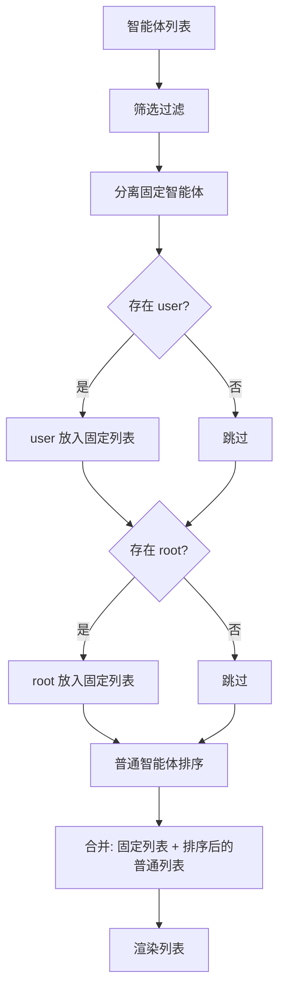

# Design Document

## Overview

本设计为智能体列表的排序功能添加固定置顶支持。核心思路是在现有的 `SortUtils` 中新增一个排序函数，该函数会将 `user` 和 `root` 智能体从普通排序中分离出来，始终放在列表顶部，然后对剩余的普通智能体应用正常的时间排序。

## Architecture



## Components and Interfaces

### SortUtils 扩展

在 `web/js/utils/sort.js` 中添加新的排序函数：

```javascript
/**
 * 按创建时间排序智能体列表，固定 user 和 root 在顶部
 * @param {Array} agents - 智能体数组
 * @param {string} order - 排序方向 ('asc' 或 'desc')
 * @returns {Array} 排序后的新数组，user 在第一位，root 在第二位
 */
sortWithPinnedAgents(agents, order = this.ASC) {
  if (!Array.isArray(agents)) {
    return [];
  }
  
  // 分离固定智能体和普通智能体
  const pinned = [];
  const regular = [];
  
  let userAgent = null;
  let rootAgent = null;
  
  for (const agent of agents) {
    if (agent.id === 'user') {
      userAgent = agent;
    } else if (agent.id === 'root') {
      rootAgent = agent;
    } else {
      regular.push(agent);
    }
  }
  
  // 按固定顺序添加: user 第一，root 第二
  if (userAgent) pinned.push(userAgent);
  if (rootAgent) pinned.push(rootAgent);
  
  // 对普通智能体排序
  const sortedRegular = this.sortByCreatedAt(regular, order);
  
  // 合并结果
  return [...pinned, ...sortedRegular];
}
```

### AgentList 组件修改

修改 `web/js/components/agent-list.js` 中的 `applyFilterAndSort` 方法：

```javascript
applyFilterAndSort() {
  // 先筛选
  let result = FilterUtils.filterByKeyword(this.agents, this.filterKeyword);
  // 使用新的固定排序函数
  result = SortUtils.sortWithPinnedAgents(result, this.sortOrder);
  this.filteredAgents = result;
}
```

## Data Models

无需新增数据模型。现有的智能体对象结构保持不变：

```javascript
{
  id: string,           // 智能体 ID，'user' 和 'root' 为特殊 ID
  roleId: string,       // 角色 ID
  roleName: string,     // 角色名称
  parentAgentId: string,// 父智能体 ID
  createdAt: string,    // 创建时间 (ISO 格式)
  status: string        // 状态 ('active' 或 'terminated')
}
```

## Correctness Properties

*A property is a characteristic or behavior that should hold true across all valid executions of a system—essentially, a formal statement about what the system should do. Properties serve as the bridge between human-readable specifications and machine-verifiable correctness guarantees.*

### Property 1: 固定智能体始终在顶部且顺序正确

*For any* agent list containing pinned agents (user and/or root), after applying `sortWithPinnedAgents`, the user agent (if present) should be at position 0, and the root agent (if present) should be immediately after user (or at position 0 if user is absent).

**Validates: Requirements 1.1, 1.2, 1.3, 1.4, 1.5**

### Property 2: 排序方向不影响固定智能体位置

*For any* agent list and *for any* sort order (ascending or descending), the positions of pinned agents in the result should be identical.

**Validates: Requirements 2.1, 2.2, 2.3**

### Property 3: 普通智能体按时间正确排序

*For any* agent list, after applying `sortWithPinnedAgents`, the regular agents (those after pinned agents) should be sorted by creation time according to the specified order.

**Validates: Requirements 2.4, 3.1, 3.2, 3.3**

### Property 4: 筛选后固定智能体保持相对位置

*For any* agent list and *for any* filter keyword, pinned agents that pass the filter should maintain their relative positions (user before root) at the top of the filtered and sorted result.

**Validates: Requirements 4.1, 4.2, 4.3, 4.4, 4.5**

## Error Handling

| 场景 | 处理方式 |
|------|----------|
| 输入不是数组 | 返回空数组 `[]` |
| 空数组输入 | 返回空数组 `[]` |
| 智能体缺少 `id` 字段 | 视为普通智能体处理 |
| 智能体缺少 `createdAt` 字段 | 使用默认时间 0 进行排序 |

## Testing Strategy

### 单元测试

- 测试空数组输入
- 测试只有 user 的情况
- 测试只有 root 的情况
- 测试只有普通智能体的情况
- 测试 user 和 root 都存在的情况

### 属性测试

使用 fast-check 进行属性测试，每个属性测试运行至少 100 次迭代。

测试框架: Bun test + fast-check

测试文件位置: `test/web/sort.test.js`（扩展现有测试文件）

每个属性测试需要标注对应的设计属性编号和验证的需求条款。
