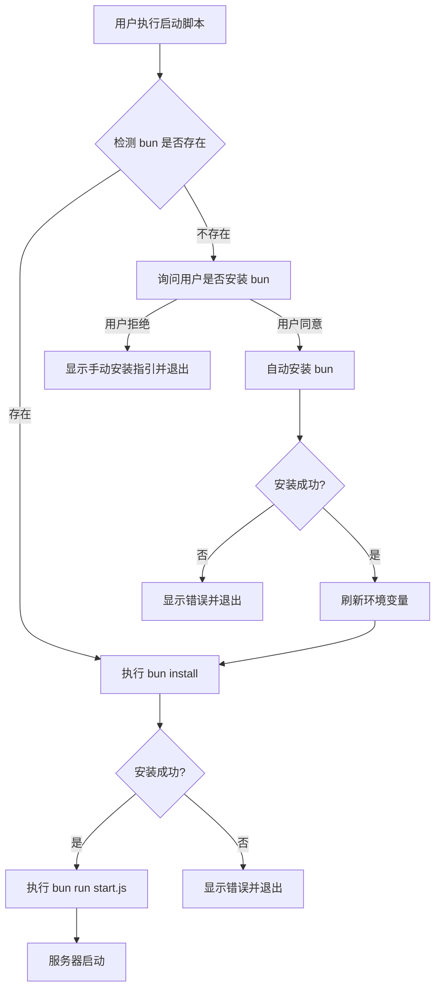

# Design Document

## Overview

本设计描述如何修改现有的启动脚本（start.cmd 和 start.sh），实现 bun 的自动检测、安装和依赖管理。设计遵循最小改动原则，在现有脚本基础上增加自动化逻辑。

## Architecture



## Components and Interfaces

### 1. start.cmd (Windows)

Windows 批处理脚本，负责：
- 使用 `where bun` 检测 bun
- 使用 PowerShell 执行 bun 官方安装脚本
- 刷新 PATH 环境变量以识别新安装的 bun
- 执行 `bun install` 和 `bun run start.js`

### 2. start.sh (Unix/macOS)

Bash 脚本，负责：
- 使用 `command -v bun` 检测 bun
- 使用 curl 执行 bun 官方安装脚本
- 更新 PATH 以包含 bun 安装路径
- 执行 `bun install` 和 `bun run start.js`

## Data Models

无需数据模型，本功能仅涉及脚本逻辑。

## Detailed Design

### Windows (start.cmd) 流程

```batch
1. 切换到脚本目录
2. 检测 bun (where bun)
3. 如果不存在:
   a. 询问用户是否安装 bun (Y/N)
   b. 如果用户拒绝，显示手动安装指引并退出
   c. 显示安装提示
   d. 使用 PowerShell 执行: irm bun.sh/install.ps1 | iex
   e. 刷新 PATH (从注册表读取用户 PATH)
   f. 再次检测 bun，失败则退出
4. 执行 bun install
5. 检查安装结果，失败则退出
6. 执行 bun run start.js 并传递参数
```

### Unix/macOS (start.sh) 流程

```bash
1. 切换到脚本目录
2. 检测 bun (command -v bun)
3. 如果不存在:
   a. 询问用户是否安装 bun (y/n)
   b. 如果用户拒绝，显示手动安装指引并退出
   c. 显示安装提示
   d. 使用 curl 执行: curl -fsSL https://bun.sh/install | bash
   e. 添加 ~/.bun/bin 到 PATH
   f. 再次检测 bun，失败则退出
4. 执行 bun install
5. 检查安装结果，失败则退出
6. 执行 bun run start.js 并传递参数
```

### Bun 安装命令

- **Windows**: `powershell -c "irm bun.sh/install.ps1 | iex"`
- **Unix/macOS**: `curl -fsSL https://bun.sh/install | bash`

### PATH 刷新策略

**Windows**:
- 从注册表 `HKCU\Environment` 读取用户 PATH
- 与系统 PATH 合并后设置到当前会话

**Unix/macOS**:
- 直接将 `$HOME/.bun/bin` 添加到 PATH
- bun 默认安装到此位置


## Correctness Properties

*A property is a characteristic or behavior that should hold true across all valid executions of a system-essentially, a formal statement about what the system should do. Properties serve as the bridge between human-readable specifications and machine-verifiable correctness guarantees.*

由于本功能主要涉及 shell 脚本的系统集成行为（检测命令、执行安装、环境变量操作），这些操作依赖于实际操作系统环境，不适合通过属性测试进行自动化验证。

本功能的正确性主要通过以下方式保证：
1. 代码审查 - 确保脚本语法正确
2. 手动集成测试 - 在实际系统上验证完整流程
3. 错误处理验证 - 确保错误情况有明确的用户反馈

## Error Handling

### 错误场景及处理

| 错误场景 | 处理方式 |
|---------|---------|
| 用户拒绝安装 bun | 显示手动安装指引 (https://bun.sh)，正常退出 |
| bun 安装失败 | 显示错误信息，提供手动安装链接 (https://bun.sh) |
| bun install 失败 | 显示错误信息，提示检查网络连接或 package.json |
| PATH 刷新失败 (Windows) | 提示用户重新打开命令行窗口 |
| curl 不可用 (Unix) | 显示错误信息，提示安装 curl |

### 错误消息格式

```
错误: [错误描述]
解决方案: [具体建议]
```

## Testing Strategy

### 测试方法

由于本功能是 shell 脚本，主要通过手动集成测试验证：

1. **Windows 测试场景**:
   - 在未安装 bun 的 Windows 系统上运行 start.cmd
   - 验证 bun 自动安装成功
   - 验证依赖安装成功
   - 验证服务器正常启动

2. **Unix/macOS 测试场景**:
   - 在未安装 bun 的 Unix 系统上运行 start.sh
   - 验证 bun 自动安装成功
   - 验证依赖安装成功
   - 验证服务器正常启动

3. **已安装 bun 场景**:
   - 在已安装 bun 的系统上运行启动脚本
   - 验证跳过安装步骤
   - 验证依赖安装执行
   - 验证服务器正常启动

4. **错误处理测试**:
   - 模拟网络断开，验证安装失败的错误提示
   - 验证错误消息清晰且包含解决建议

### 不使用属性测试的原因

本功能不适合属性测试，因为：
- 涉及系统级操作（命令检测、软件安装）
- 依赖外部网络资源
- 需要修改系统环境变量
- 行为因操作系统而异
