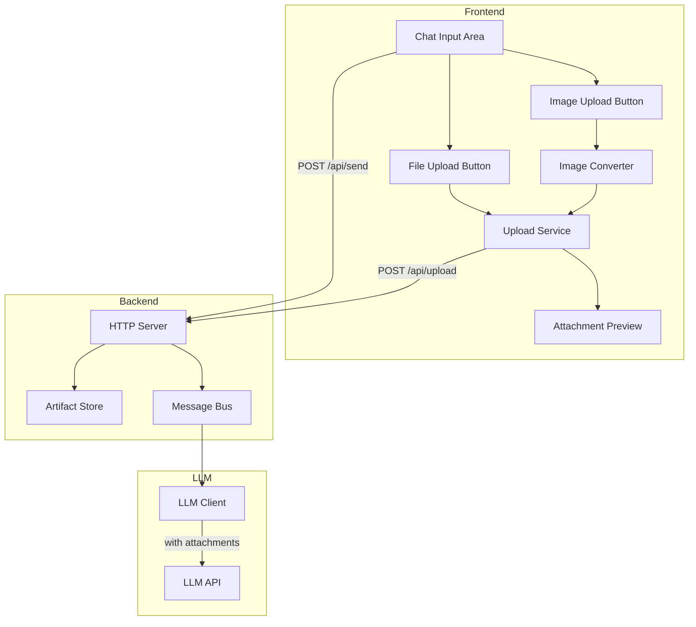

# Design Document: Chat File Upload

## Overview

本设计文档描述了聊天界面文件上传功能的技术实现方案。该功能允许用户在发送消息时附带图片或其他文件，系统会在前端进行图片格式转换（转为JPEG），然后上传到服务器保存为工件，并在调用大模型时携带这些附件。

## Architecture



## Components and Interfaces

### 1. Image Converter (Frontend)

负责将非JPEG格式的图片转换为JPEG格式。支持浏览器能够解码的所有图片格式。

```javascript
/**
 * 图片格式转换器
 */
const ImageConverter = {
  /**
   * 将图片文件转换为JPEG格式
   * @param {File} file - 原始图片文件
   * @param {number} quality - JPEG质量 (0-1)，默认0.85
   * @returns {Promise<{blob: Blob, dataUrl: string}>} 转换后的JPEG数据
   */
  async convertToJpeg(file, quality = 0.85) {
    // 使用Canvas API进行格式转换
    // 1. 创建Image对象加载文件
    // 2. 绘制到Canvas
    // 3. 导出为JPEG格式
  },
  
  /**
   * 检查文件是否为浏览器支持的图片格式
   * 通过尝试加载图片来验证，而不是检查MIME类型列表
   * @param {File} file - 文件对象
   * @returns {Promise<boolean>}
   */
  async isSupportedImage(file) {
    // 检查文件类型是否以 'image/' 开头
    if (!file.type.startsWith('image/')) {
      return false;
    }
    // 尝试加载图片来验证浏览器是否支持该格式
    return new Promise((resolve) => {
      const img = new Image();
      const url = URL.createObjectURL(file);
      img.onload = () => {
        URL.revokeObjectURL(url);
        resolve(true);
      };
      img.onerror = () => {
        URL.revokeObjectURL(url);
        resolve(false);
      };
      img.src = url;
    });
  }
};
```

**支持的图片格式说明：**
- 不硬编码支持的格式列表，而是依赖浏览器的图片解码能力
- 通过尝试加载图片来动态检测浏览器是否支持该格式
- 常见支持的格式包括：JPEG、PNG、GIF、WebP、BMP、ICO、SVG等
- 现代浏览器还可能支持：AVIF、HEIC（部分浏览器）等新格式

### 2. Upload Service (Frontend)

负责处理文件上传逻辑，包括进度跟踪和状态管理。

```javascript
/**
 * 上传服务
 */
const UploadService = {
  /**
   * 上传文件到服务器
   * @param {Blob|File} file - 文件数据
   * @param {object} options - 上传选项
   * @param {string} options.type - 文件类型 ('image' | 'file')
   * @param {string} options.filename - 文件名
   * @param {function} options.onProgress - 进度回调
   * @returns {Promise<{artifactRef: string, metadata: object}>}
   */
  async upload(file, options) {
    // 使用 XMLHttpRequest 或 fetch 上传，支持进度回调
  },
  
  /**
   * 批量上传文件
   * @param {Array<{file: Blob|File, options: object}>} files
   * @returns {Promise<Array<{artifactRef: string, metadata: object}>>}
   */
  async uploadAll(files) {
    // 并行上传所有文件
  }
};
```

### 3. Attachment Manager (Frontend)

管理待发送的附件列表。

```javascript
/**
 * 附件管理器
 */
const AttachmentManager = {
  /** @type {Array<{id: string, file: File|Blob, type: string, status: string, artifactRef?: string, preview?: string}>} */
  attachments: [],
  
  /**
   * 添加附件
   * @param {File} file - 文件对象
   * @param {string} type - 类型 ('image' | 'file')
   * @returns {string} 附件ID
   */
  add(file, type) {},
  
  /**
   * 移除附件
   * @param {string} id - 附件ID
   */
  remove(id) {},
  
  /**
   * 清空所有附件
   */
  clear() {},
  
  /**
   * 获取所有已上传的附件引用
   * @returns {Array<string>}
   */
  getArtifactRefs() {}
};
```

### 4. HTTP Server Upload Endpoint (Backend)

新增文件上传API端点。

```javascript
// POST /api/upload
// Content-Type: multipart/form-data
// 
// Request:
//   - file: 文件数据
//   - type: 'image' | 'file'
//   - filename: 原始文件名
//
// Response:
//   {
//     ok: true,
//     artifactRef: "artifact:uuid",
//     metadata: {
//       id: "uuid",
//       type: "image",
//       filename: "photo.jpg",
//       size: 12345,
//       mimeType: "image/jpeg",
//       createdAt: "2026-01-10T..."
//     }
//   }
```

### 5. Message Format Extension

扩展消息格式以支持附件。

```javascript
// 带附件的消息 payload 格式
{
  text: "用户输入的文本",
  attachments: [
    {
      type: "image",
      artifactRef: "artifact:uuid-1",
      filename: "photo.jpg"
    },
    {
      type: "file",
      artifactRef: "artifact:uuid-2",
      filename: "document.pdf"
    }
  ]
}
```

### 6. LLM Client Extension

扩展LLM客户端以支持多模态消息。

```javascript
// 构建带图片的LLM消息格式 (OpenAI Vision API格式)
{
  role: "user",
  content: [
    {
      type: "text",
      text: "用户输入的文本"
    },
    {
      type: "image_url",
      image_url: {
        url: "data:image/jpeg;base64,..."
      }
    }
  ]
}
```

## Data Models

### Attachment

```typescript
interface Attachment {
  id: string;           // 前端生成的临时ID
  file: File | Blob;    // 文件数据
  type: 'image' | 'file';
  filename: string;
  size: number;
  status: 'pending' | 'uploading' | 'ready' | 'error';
  progress: number;     // 0-100
  artifactRef?: string; // 上传成功后的工件引用
  preview?: string;     // 图片预览URL (data URL)
  error?: string;       // 错误信息
}
```

### Upload Response

```typescript
interface UploadResponse {
  ok: boolean;
  artifactRef?: string;
  metadata?: {
    id: string;
    type: string;
    filename: string;
    size: number;
    mimeType: string;
    createdAt: string;
  };
  error?: string;
}
```

### Message Payload with Attachments

```typescript
interface MessagePayloadWithAttachments {
  text: string;
  attachments?: Array<{
    type: 'image' | 'file';
    artifactRef: string;
    filename: string;
  }>;
}
```

## Correctness Properties

*A property is a characteristic or behavior that should hold true across all valid executions of a system—essentially, a formal statement about what the system should do. Properties serve as the bridge between human-readable specifications and machine-verifiable correctness guarantees.*

### Property 1: Image Conversion Produces Valid JPEG

*For any* image file that the browser can successfully decode (regardless of original format), when passed through the Image_Converter, the output SHALL be a valid JPEG blob with the correct MIME type (image/jpeg).

**Validates: Requirements 1.3, 3.1, 3.2, 3.3**

### Property 2: JPEG Passthrough Preserves Data

*For any* JPEG image file, when passed through the Image_Converter, the output SHALL be equivalent to the input (no re-encoding unless explicitly requested).

**Validates: Requirements 3.4**

### Property 3: Image Quality Preservation

*For any* image converted to JPEG, the compression quality parameter SHALL be >= 0.85, ensuring reasonable visual quality is maintained.

**Validates: Requirements 3.5**

### Property 4: File Size Validation

*For any* file upload request where the file size exceeds the configured maximum limit, the HTTP_Server SHALL reject the request with an appropriate error response.

**Validates: Requirements 4.2, 4.6**

### Property 5: Upload Success Response Format

*For any* valid file upload, the HTTP_Server response SHALL contain both an artifact reference (format: "artifact:uuid") and metadata including id, type, filename, size, mimeType, and createdAt.

**Validates: Requirements 4.3, 4.4, 4.5**

### Property 6: Message Attachment References Integrity

*For any* message sent with attachments, the stored message payload SHALL contain valid artifact references that correspond to existing artifacts in the Artifact_Store.

**Validates: Requirements 5.2, 5.3**

### Property 7: LLM Request Multimodal Format

*For any* message with image attachments sent to the LLM, the request SHALL include the images in the OpenAI Vision API format with base64-encoded image data.

**Validates: Requirements 6.1, 6.2**

### Property 8: Attachment Removal Decreases Count

*For any* attachment list with N items (N > 0), removing one attachment SHALL result in a list with exactly N-1 items.

**Validates: Requirements 7.3**

### Property 9: Send Clears All Attachments

*For any* successful message send operation, the attachment list SHALL be empty after completion.

**Validates: Requirements 7.5**

### Property 10: Upload Status Transitions

*For any* file being uploaded, the status SHALL transition from 'pending' to 'uploading', then to either 'ready' (on success) or 'error' (on failure).

**Validates: Requirements 8.2, 8.4**

## Error Handling

### Frontend Errors

| Error Type | Handling |
|------------|----------|
| Unsupported image format | Display toast: "不支持的图片格式，请选择 JPEG、PNG、BMP 或 WebP" |
| Image conversion failed | Display toast: "图片转换失败，请重试" |
| File too large | Display toast: "文件大小超过限制（最大 10MB）" |
| Upload failed | Display error indicator on attachment, allow retry |
| Network error | Display toast: "网络错误，请检查连接" |

### Backend Errors

| Error Code | HTTP Status | Description |
|------------|-------------|-------------|
| `file_too_large` | 413 | 文件大小超过限制 |
| `invalid_file_type` | 400 | 不支持的文件类型 |
| `upload_failed` | 500 | 服务器存储失败 |
| `missing_file` | 400 | 请求中缺少文件 |

## Testing Strategy

### Unit Tests

1. **ImageConverter Tests**
   - Test PNG to JPEG conversion
   - Test BMP to JPEG conversion
   - Test WebP to JPEG conversion
   - Test JPEG passthrough
   - Test unsupported format rejection
   - Test conversion with various quality settings

2. **AttachmentManager Tests**
   - Test add attachment
   - Test remove attachment
   - Test clear all attachments
   - Test get artifact refs

3. **Upload Endpoint Tests**
   - Test successful image upload
   - Test successful file upload
   - Test file size validation
   - Test missing file error
   - Test metadata generation

### Property-Based Tests

使用 fast-check 库进行属性测试：

1. **Property 1: Image Conversion** - 生成随机图片数据，验证转换输出为有效JPEG
2. **Property 4: File Size Validation** - 生成随机大小的文件，验证超限文件被拒绝
3. **Property 5: Upload Response Format** - 生成随机有效文件，验证响应格式正确
4. **Property 8: Attachment Removal** - 生成随机附件列表，验证移除操作正确减少数量
5. **Property 9: Send Clears Attachments** - 生成随机附件列表，验证发送后清空

### Integration Tests

1. 完整上传流程测试（前端选择文件 → 转换 → 上传 → 获取引用）
2. 带附件消息发送测试
3. LLM调用携带图片测试
