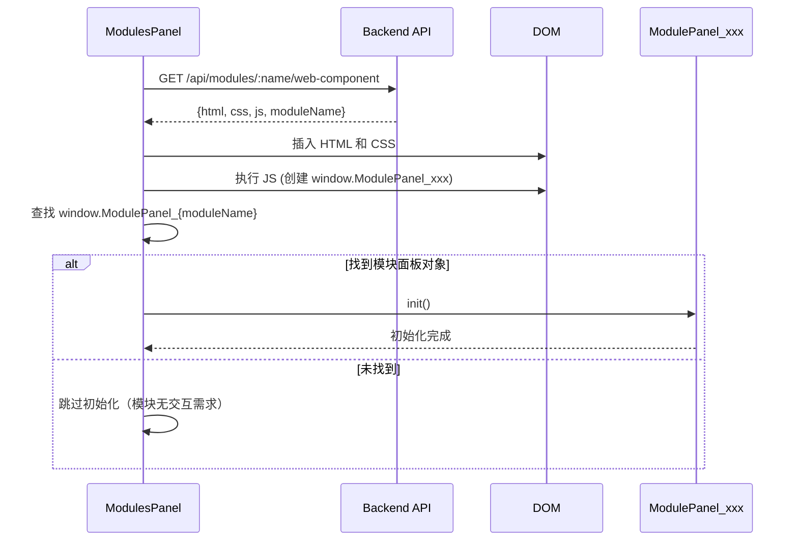

# Design Document: Chat Image Display and Chrome Panel Fix

## Overview

本设计文档描述两个功能的实现方案：
1. 聊天界面图片展示功能 - 支持缩略图显示和点击放大
2. Chrome 模块面板加载修复 - 解决一直显示"加载中"的问题，并重构模块初始化机制

## Architecture

### 整体架构

```
┌─────────────────────────────────────────────────────────────┐
│                      Web Frontend                            │
├─────────────────────────────────────────────────────────────┤
│  ┌─────────────┐  ┌─────────────┐  ┌─────────────────────┐  │
│  │ ChatPanel   │  │ImageViewer  │  │   ModulesPanel      │  │
│  │ (图片缩略图) │  │ (图片放大)  │  │ (通用模块加载器)    │  │
│  └─────────────┘  └─────────────┘  └─────────────────────┘  │
│                                              │               │
│                                    ┌─────────▼─────────┐    │
│                                    │ ModulePanel_xxx   │    │
│                                    │ (标准模块面板接口) │    │
│                                    └───────────────────┘    │
└─────────────────────────────────────────────────────────────┘
                              │
                              ▼
┌─────────────────────────────────────────────────────────────┐
│                      Backend API                             │
├─────────────────────────────────────────────────────────────┤
│  /api/modules/:name/web-component                           │
│  /api/modules/chrome/browsers                               │
│  /artifacts/screenshots/*                                   │
└─────────────────────────────────────────────────────────────┘
```

### 模块面板初始化流程



## Components and Interfaces

### 1. 消息图片字段标准化

#### 数据结构

```javascript
// 消息对象中的图片字段
{
  id: "msg-xxx",
  from: "agent-1",
  to: "agent-2",
  payload: {
    text: "操作已完成",
    images: [                    // 统一使用 images 数组
      "2026-01-08T10-30-00-000Z_abc123.jpg",
      "2026-01-08T10-30-01-000Z_def456.jpg"
    ]
  },
  createdAt: "2026-01-08T10:30:00.000Z"
}
```

#### ArtifactStore.saveScreenshot 方法修改

```javascript
// artifact_store.js - saveScreenshot 方法
// 1. 图片直接保存在 artifacts 目录下，不创建子文件夹
// 2. 返回值不变，调用方负责将路径放入 images 数组
async saveScreenshot(buffer, meta = {}) {
  // 直接保存到 artifacts 目录
  const fileName = `${timestamp}_${id}.jpg`;
  const filePath = path.resolve(this.artifactsDir, fileName);
  await writeFile(filePath, buffer);
  return fileName;  // 返回文件名（相对于 artifacts 目录）
}
```

#### 截图工具返回值修改

```javascript
// page_actions.js - screenshot 方法返回值
{
  ok: true,
  images: [filePath],           // 改用 images 数组（原来是 filePath 字段）
  url: pageUrl,
  title: pageTitle,
  fullPage: false,
  selector: null
}
```

### 2. ImageViewer 组件

#### 接口定义

```javascript
const ImageViewer = {
  // 当前状态
  isOpen: false,
  images: [],           // 图片路径数组
  currentIndex: 0,      // 当前显示的图片索引

  /**
   * 显示图片查看器
   * @param {string[]} images - 图片路径数组
   * @param {number} startIndex - 起始索引
   */
  show(images, startIndex = 0),

  /**
   * 关闭图片查看器
   */
  close(),

  /**
   * 导航到上一张图片
   */
  prev(),

  /**
   * 导航到下一张图片
   */
  next(),

  /**
   * 渲染模态框
   */
  render()
};
```

### 3. ChatPanel 图片渲染

#### 渲染方法扩展

```javascript
// chat-panel.js 新增方法
ChatPanel = {
  // ... 现有方法 ...

  /**
   * 渲染消息中的图片缩略图
   * @param {object} message - 消息对象
   * @returns {string} HTML 字符串
   */
  renderMessageImages(message) {
    const images = message.payload?.images || [];
    if (images.length === 0) return '';
    
    return `
      <div class="message-images">
        ${images.map((img, idx) => `
          
        `).join('')}
      </div>
    `;
  }
};
```

### 4. ModulesPanel 通用初始化机制

#### 标准命名约定

模块面板对象必须注册为 `window.ModulePanel_{moduleName}`，其中 `moduleName` 使用 PascalCase 格式。

例如：
- chrome 模块 → `window.ModulePanel_Chrome`
- file 模块 → `window.ModulePanel_File`

#### 接口定义

```javascript
// 模块面板标准接口
interface ModulePanelInterface {
  /**
   * 初始化模块面板
   * @returns {Promise<void>}
   */
  init(): Promise<void>;

  /**
   * 刷新模块数据（可选）
   */
  refresh?(): Promise<void>;
}
```

#### ModulesPanel 改造

```javascript
const ModulesPanel = {
  // ... 现有属性 ...

  /**
   * 渲染模块组件（重构后）
   */
  renderModuleComponent(moduleName, componentData) {
    const { html, css, js, displayName } = componentData;
    
    // 1. 插入 HTML 和 CSS
    // 2. 执行 JS
    // 3. 通用初始化（不再硬编码模块名）
    this.initModulePanel(moduleName);
  },

  /**
   * 通用模块面板初始化
   * @param {string} moduleName - 模块名称
   */
  async initModulePanel(moduleName) {
    // 将模块名转换为 PascalCase
    const pascalName = this.toPascalCase(moduleName);
    const panelKey = `ModulePanel_${pascalName}`;
    
    // 查找模块面板对象
    const panel = window[panelKey];
    
    if (panel && typeof panel.init === 'function') {
      try {
        await panel.init();
      } catch (err) {
        console.error(`模块 ${moduleName} 初始化失败:`, err);
        this.showError(`模块初始化失败: ${err.message}`);
      }
    }
    // 如果没有找到面板对象，静默跳过（模块可能不需要交互初始化）
  },

  /**
   * 将 kebab-case 转换为 PascalCase
   */
  toPascalCase(str) {
    return str.split('-')
      .map(part => part.charAt(0).toUpperCase() + part.slice(1))
      .join('');
  }
};
```

### 5. Chrome 模块面板改造

#### 重命名和注册

```javascript
// modules/chrome/web/panel.js
const ModulePanel_Chrome = {
  // ... 现有实现 ...
};

// 注册到全局（使用标准命名）
window.ModulePanel_Chrome = ModulePanel_Chrome;

// 保留旧名称以兼容（可选）
window.ChromePanel = ModulePanel_Chrome;
```

## Data Models

### 消息图片数据模型

```typescript
interface MessagePayload {
  text?: string;
  content?: string;
  message?: string;
  images?: string[];  // 图片路径数组，相对于 artifacts 目录（直接存放，无子文件夹）
}

interface Message {
  id: string;
  type?: 'message' | 'tool_call';
  from: string;
  to: string;
  taskId?: string;
  payload: MessagePayload;
  createdAt: string;
}
```

### 图片保存返回值模型

```typescript
// ArtifactStore.saveScreenshot 返回文件名
type SaveScreenshotResult = string;  // 文件名，相对于 artifacts 目录

// 截图工具返回值（使用 images 数组）
interface ScreenshotToolResult {
  ok: true;
  images: string[];      // 图片路径数组（相对于 artifacts 目录）
  url?: string;
  title?: string;
  fullPage?: boolean;
  selector?: string | null;
}
```

## Correctness Properties

*A property is a characteristic or behavior that should hold true across all valid executions of a system—essentially, a formal statement about what the system should do. Properties serve as the bridge between human-readable specifications and machine-verifiable correctness guarantees.*

### Property 1: 图片字段一致性

*For any* image save operation that succeeds, the result SHALL contain an `images` field that is an array of strings, and SHALL NOT contain fields named `screenshot_path`, `filePath`, or similar variations.

**Validates: Requirements 1.1, 1.2, 1.3, 1.4**

### Property 2: 图片缩略图渲染完整性

*For any* message with a non-empty `images` array, the rendered HTML SHALL contain exactly one `` element with class `message-thumbnail` for each image path in the array.

**Validates: Requirements 2.1**

### Property 3: 模块面板通用初始化

*For any* module with a web component, the ModulesPanel SHALL look up `window.ModulePanel_{PascalCaseName}` and call its `init()` method if it exists, without any module-specific hardcoded logic.

**Validates: Requirements 5.1, 5.2, 5.4, 6.2, 6.3, 6.4**

### Property 4: 浏览器列表渲染

*For any* API response containing a `browsers` array, the Chrome module panel SHALL render exactly one `.browser-item` element for each browser in the array.

**Validates: Requirements 4.5**

### Property 5: 图片查看器尺寸约束

*For any* image displayed in the ImageViewer modal, the displayed dimensions SHALL be at most the original image dimensions AND at most the viewport dimensions minus padding.

**Validates: Requirements 3.2**

## Error Handling

### 图片加载错误

1. 缩略图加载失败时，显示错误占位符
2. 大图加载失败时，在模态框中显示错误提示

### 模块初始化错误

1. JavaScript 执行失败：显示脚本执行错误信息
2. init() 方法抛出异常：显示初始化失败信息
3. API 请求失败：显示网络错误信息
4. 超时：5秒后显示超时错误

### Chrome 面板加载错误

1. API 返回错误：显示具体错误信息
2. 空数据：显示"暂无浏览器实例"
3. 网络错误：显示"加载失败: [错误信息]"

## Testing Strategy

### 单元测试

1. **ImageViewer 组件测试**
   - 测试 show/close/prev/next 方法
   - 测试键盘导航
   - 测试边界情况（单图、多图、空数组）

2. **ChatPanel 图片渲染测试**
   - 测试 renderMessageImages 方法
   - 测试空图片数组
   - 测试多图片渲染

3. **ModulesPanel 初始化测试**
   - 测试 toPascalCase 转换
   - 测试 initModulePanel 查找和调用
   - 测试模块不存在时的处理

### 属性测试

使用 fast-check 进行属性测试，每个属性测试至少运行 100 次迭代。

1. **Property 1 测试**: 生成随机截图参数，验证工具返回值使用 `images` 数组格式
2. **Property 2 测试**: 生成随机图片路径数组，验证渲染结果
3. **Property 3 测试**: 生成随机模块名，验证初始化流程
4. **Property 4 测试**: 生成随机浏览器数据，验证渲染结果
5. **Property 5 测试**: 生成随机图片尺寸，验证显示尺寸约束

### 集成测试

1. 端到端测试截图功能和图片显示
2. 测试 Chrome 模块面板完整加载流程
3. 测试模块热重载和刷新
