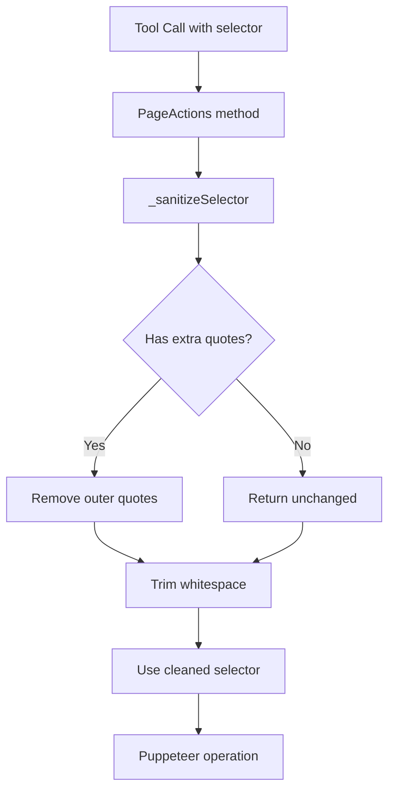

# Design Document

## Overview

本设计为 Chrome 模块的 `PageActions` 类添加选择器清理功能，解决 LLM 生成的选择器参数可能包含多余引号的问题。通过集中式的清理方法，确保所有页面交互操作都能正确处理选择器。

## Architecture



## Components and Interfaces

### _sanitizeSelector 方法

```javascript
/**
 * 清理选择器字符串，移除多余的引号和空白
 * @param {string} selector - 原始选择器
 * @returns {{original: string, cleaned: string, modified: boolean}}
 */
_sanitizeSelector(selector) {
  const original = selector;
  let cleaned = selector.trim();
  
  // 移除首尾的双引号
  if (cleaned.startsWith('"') && cleaned.endsWith('"') && cleaned.length >= 2) {
    cleaned = cleaned.slice(1, -1);
  }
  // 移除首尾的单引号
  else if (cleaned.startsWith("'") && cleaned.endsWith("'") && cleaned.length >= 2) {
    cleaned = cleaned.slice(1, -1);
  }
  
  // 再次 trim 以处理引号内的空白
  cleaned = cleaned.trim();
  
  return {
    original,
    cleaned,
    modified: original !== cleaned
  };
}
```

### 方法修改清单

以下方法需要集成 `_sanitizeSelector`：

| 方法 | 选择器参数 | 修改说明 |
|------|-----------|---------|
| `click` | `selector` | 清理后用于 waitForSelector 和 click |
| `type` | `selector` | 清理后用于 waitForSelector 和 type |
| `fill` | `selector` | 清理后用于 waitForSelector、$eval 和 type |
| `waitFor` | `selector` | 清理后用于 waitForSelector |
| `getText` | `selector` | 清理后用于 $ 查询 |
| `getContent` | `selector` | 清理后用于 $ 查询 |
| `screenshot` | `selector` | 清理后用于 $ 查询（可选参数）|

## Data Models

### SanitizeResult

```javascript
/**
 * @typedef {Object} SanitizeResult
 * @property {string} original - 原始选择器
 * @property {string} cleaned - 清理后的选择器
 * @property {boolean} modified - 是否被修改
 */
```

### 错误响应增强

```javascript
// 原有错误响应
{ error: "click_failed", selector, message }

// 增强后的错误响应
{ error: "click_failed", selector: cleaned, originalSelector: original, message }
```


## Correctness Properties

*A property is a characteristic or behavior that should hold true across all valid executions of a system—essentially, a formal statement about what the system should do. Properties serve as the bridge between human-readable specifications and machine-verifiable correctness guarantees.*

### Property 1: Outer Quote Removal

*For any* valid CSS selector string wrapped in outer double quotes, single quotes, or whitespace, the `_sanitizeSelector` method SHALL return a cleaned selector with those outer characters removed.

**Validates: Requirements 1.1, 1.2, 1.3**

### Property 2: Clean Selector Idempotence

*For any* valid CSS selector string without outer quotes or whitespace, the `_sanitizeSelector` method SHALL return the selector unchanged (idempotent for clean inputs).

**Validates: Requirements 1.4**

### Property 3: Internal Quote Preservation

*For any* CSS attribute selector containing internal quotes (e.g., `[data-id="value"]`), the `_sanitizeSelector` method SHALL preserve those internal quotes while only removing outer wrapper quotes if present.

**Validates: Requirements 1.5**

## Error Handling

| 场景 | 处理方式 |
|------|---------|
| 选择器为空字符串 | 返回空字符串，不抛出错误 |
| 选择器为 null/undefined | 返回原值，让后续 Puppeteer 报错 |
| 选择器只有引号 `""` | 清理后返回空字符串 |
| 嵌套引号 `"'#id'"` | 只移除最外层引号 |

## Testing Strategy

### 单元测试

- 测试 `_sanitizeSelector` 方法的各种输入情况
- 测试各个页面操作方法是否正确调用清理逻辑
- 测试错误响应是否包含原始和清理后的选择器

### 属性测试

使用 fast-check 进行属性测试，验证：

1. **外层引号移除属性**: 生成随机选择器，包裹引号后清理，验证引号被移除
2. **幂等性属性**: 对已清理的选择器再次清理，结果不变
3. **内部引号保留属性**: 生成带属性选择器的字符串，验证内部引号保留

配置：每个属性测试运行 100 次迭代。

测试标签格式：**Feature: chrome-selector-sanitization, Property N: {property_text}**
