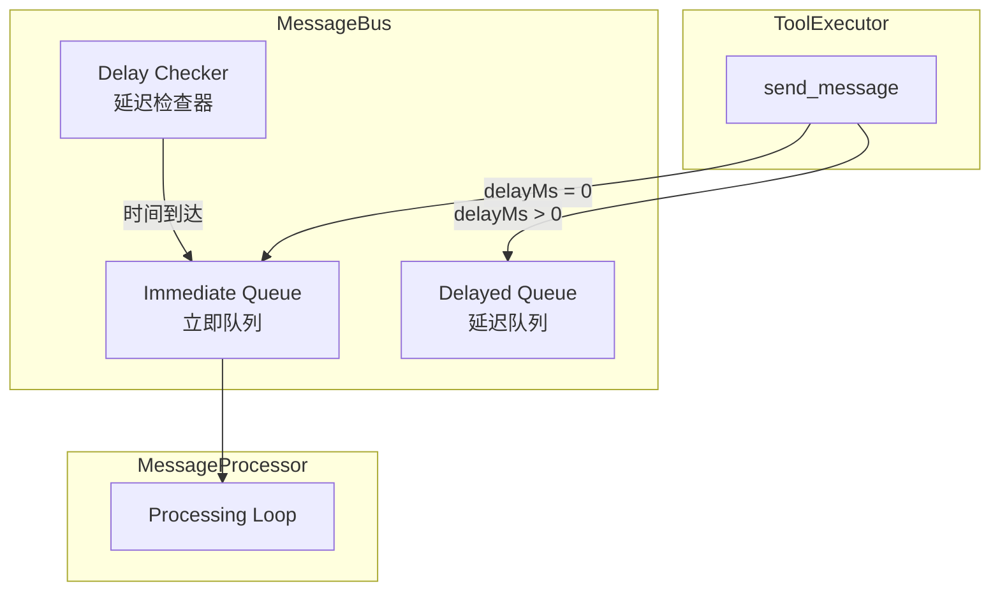

# Design Document: Delayed Message Delivery

## Overview

本设计为消息总线添加延迟投递能力，允许智能体发送的消息在指定延迟时间后才进入收件人队列。实现采用独立的延迟队列配合定时检查机制，确保延迟消息在正确的时间被投递。

## Architecture



### 设计决策

1. **独立延迟队列**: 使用单独的 `_delayedMessages` 数组存储延迟消息，而非修改现有队列结构
2. **定时检查机制**: 在消息处理循环中周期性检查延迟消息，避免引入额外的定时器
3. **按投递时间排序**: 延迟队列按 `deliverAt` 时间戳排序，便于高效检查
4. **最小侵入性**: 仅修改 `MessageBus.send()` 和添加延迟检查逻辑，不改变现有消息处理流程

## Components and Interfaces

### MessageBus 扩展

```javascript
class MessageBus {
  constructor(options = {}) {
    this._queues = new Map();           // 现有：立即队列
    this._delayedMessages = [];         // 新增：延迟消息数组
    this._waiters = new Set();
    this.log = options.logger ?? createNoopModuleLogger();
  }

  /**
   * 发送消息（支持延迟）
   * @param {{to:string, from:string, payload:any, taskId?:string, delayMs?:number}} message
   * @returns {{messageId:string, scheduledDeliveryTime?:string}}
   */
  send(message) {
    const id = randomUUID();
    const now = Date.now();
    const delayMs = Math.max(0, message.delayMs ?? 0);
    
    const envelope = {
      id,
      createdAt: new Date(now).toISOString(),
      to: message.to,
      from: message.from,
      payload: message.payload,
      taskId: message.taskId
    };

    if (delayMs > 0) {
      // 延迟投递
      const deliverAt = now + delayMs;
      this._delayedMessages.push({ ...envelope, deliverAt });
      this._delayedMessages.sort((a, b) => a.deliverAt - b.deliverAt);
      
      void this.log.info("发送延迟消息", {
        id, to: envelope.to, from: envelope.from,
        delayMs, deliverAt: new Date(deliverAt).toISOString()
      });
      
      return { 
        messageId: id, 
        scheduledDeliveryTime: new Date(deliverAt).toISOString() 
      };
    }

    // 立即投递（现有逻辑）
    const q = this._queues.get(envelope.to) ?? [];
    q.push(envelope);
    this._queues.set(envelope.to, q);
    
    for (const w of this._waiters) w();
    this._waiters.clear();
    
    return { messageId: id };
  }

  /**
   * 检查并投递到期的延迟消息
   * @returns {number} 投递的消息数量
   */
  deliverDueMessages() {
    const now = Date.now();
    let deliveredCount = 0;
    
    while (this._delayedMessages.length > 0) {
      const msg = this._delayedMessages[0];
      if (msg.deliverAt > now) break;
      
      // 移除延迟队列
      this._delayedMessages.shift();
      
      // 投递到立即队列
      const { deliverAt, ...envelope } = msg;
      const q = this._queues.get(envelope.to) ?? [];
      q.push(envelope);
      this._queues.set(envelope.to, q);
      
      deliveredCount++;
      
      void this.log.info("延迟消息已投递", {
        id: envelope.id,
        to: envelope.to,
        scheduledAt: new Date(deliverAt).toISOString(),
        actualDeliveryAt: new Date(now).toISOString(),
        delayDrift: now - deliverAt
      });
    }
    
    if (deliveredCount > 0) {
      for (const w of this._waiters) w();
      this._waiters.clear();
    }
    
    return deliveredCount;
  }

  /**
   * 获取延迟消息数量
   * @param {string} [recipientId] - 可选，指定收件人
   * @returns {number}
   */
  getDelayedCount(recipientId) {
    if (recipientId) {
      return this._delayedMessages.filter(m => m.to === recipientId).length;
    }
    return this._delayedMessages.length;
  }

  /**
   * 强制投递所有延迟消息（用于关闭时）
   * @returns {number} 投递的消息数量
   */
  forceDeliverAllDelayed() {
    const count = this._delayedMessages.length;
    
    for (const msg of this._delayedMessages) {
      const { deliverAt, ...envelope } = msg;
      const q = this._queues.get(envelope.to) ?? [];
      q.push(envelope);
      this._queues.set(envelope.to, q);
    }
    
    this._delayedMessages.length = 0;
    
    if (count > 0) {
      void this.log.info("强制投递所有延迟消息", { count });
      for (const w of this._waiters) w();
      this._waiters.clear();
    }
    
    return count;
  }
}
```

### ToolExecutor 修改

```javascript
// send_message 工具定义更新
{
  type: "function",
  function: {
    name: "send_message",
    description: "发送异步消息。from 默认使用当前智能体 id。taskId 由系统自动处理，无需传入。",
    parameters: {
      type: "object",
      properties: {
        to: { type: "string" },
        payload: { type: "object" },
        delayMs: { 
          type: "number", 
          description: "延迟投递时间（毫秒），消息将在指定时间后才进入收件人队列。不指定或为0则立即投递。" 
        }
      },
      required: ["to", "payload"]
    }
  }
}

// _executeSendMessage 方法更新
_executeSendMessage(ctx, args) {
  // ... 现有验证逻辑 ...
  
  const result = ctx.tools.sendMessage({
    to: recipientId,
    from: senderId,
    taskId: currentTaskId,
    payload: args.payload,
    delayMs: args.delayMs  // 新增：传递延迟参数
  });

  // 返回结果包含 scheduledDeliveryTime（如果是延迟消息）
  return result;
}
```

### MessageProcessor 修改

```javascript
async processingLoop() {
  // ... 现有逻辑 ...
  
  while (!runtime._stopRequested) {
    // 新增：检查并投递到期的延迟消息
    runtime.bus.deliverDueMessages();
    
    // 现有调度逻辑
    const scheduled = await this.scheduleMessageProcessing(maxConcurrent);
    // ...
  }
  
  // 关闭时处理延迟消息
  if (!runtime._forceExit) {
    const forcedCount = runtime.bus.forceDeliverAllDelayed();
    if (forcedCount > 0) {
      void runtime.log?.info?.("关闭时强制投递延迟消息", { count: forcedCount });
    }
  } else {
    const remainingDelayed = runtime.bus.getDelayedCount();
    if (remainingDelayed > 0) {
      void runtime.log?.warn?.("强制退出，丢弃延迟消息", { count: remainingDelayed });
    }
  }
  
  // ... 现有等待逻辑 ...
}
```

## Data Models

### 延迟消息信封

```typescript
interface DelayedMessageEnvelope {
  id: string;              // 消息唯一ID
  createdAt: string;       // 创建时间 (ISO 8601)
  deliverAt: number;       // 投递时间戳 (Unix ms)
  to: string;              // 收件人ID
  from: string;            // 发件人ID
  payload: object;         // 消息内容
  taskId?: string;         // 任务ID
}
```

### send_message 返回值

```typescript
interface SendMessageResult {
  messageId: string;                  // 消息ID
  scheduledDeliveryTime?: string;     // 预计投递时间 (ISO 8601)，仅延迟消息
}

// 错误情况
interface SendMessageError {
  error: string;
  // ... 其他错误字段
}
```

## Correctness Properties

*A property is a characteristic or behavior that should hold true across all valid executions of a system-essentially, a formal statement about what the system should do. Properties serve as the bridge between human-readable specifications and machine-verifiable correctness guarantees.*

### Property 1: 延迟消息不会提前投递

*For any* delayed message with delayMs > 0, the message SHALL NOT appear in the recipient's pending queue before (sendTime + delayMs) has elapsed.

**Validates: Requirements 1.1, 2.1**

### Property 2: 延迟消息最终会被投递

*For any* delayed message, if the runtime continues running, the message SHALL eventually be delivered to the recipient's pending queue after the delay time has elapsed.

**Validates: Requirements 2.1, 2.3**

### Property 3: 零延迟等价于立即投递

*For any* message with delayMs = 0 or delayMs not specified, the behavior SHALL be identical to the original send_message without delay support.

**Validates: Requirements 1.2**

### Property 4: 负延迟被规范化为零

*For any* message with delayMs < 0, the message SHALL be delivered immediately, equivalent to delayMs = 0.

**Validates: Requirements 1.3**

### Property 5: 延迟消息保持发送顺序

*For any* two delayed messages A and B sent to the same recipient where A was sent before B and both have the same deliverAt time, A SHALL be delivered before B.

**Validates: Requirements 2.2**

### Property 6: 关闭时延迟消息被强制投递

*For any* pending delayed messages when runtime stops gracefully (not force exit), all delayed messages SHALL be delivered to their recipients' queues before shutdown completes.

**Validates: Requirements 4.1**

## Error Handling

| 场景 | 处理方式 |
|------|----------|
| delayMs 为非数字 | 视为 0，立即投递 |
| delayMs 为负数 | 规范化为 0，立即投递 |
| delayMs 超大值 | 接受，但可能导致消息长时间不投递 |
| 收件人不存在 | 现有错误处理逻辑不变 |
| 系统强制退出 | 记录警告日志，延迟消息丢失 |

## Testing Strategy

### 单元测试

1. **MessageBus.send() 延迟参数测试**
   - 测试 delayMs > 0 时消息进入延迟队列
   - 测试 delayMs = 0 时消息立即入列
   - 测试 delayMs < 0 时消息立即入列
   - 测试 delayMs 未指定时消息立即入列

2. **MessageBus.deliverDueMessages() 测试**
   - 测试到期消息被正确投递
   - 测试未到期消息不被投递
   - 测试多条消息按顺序投递

3. **MessageBus.forceDeliverAllDelayed() 测试**
   - 测试所有延迟消息被强制投递
   - 测试延迟队列被清空

### 属性测试

使用 fast-check 进行属性测试，每个属性至少运行 100 次迭代。

1. **Property 1 测试**: 生成随机延迟时间，验证消息不会提前出现在队列中
2. **Property 3 测试**: 生成随机消息，验证零延迟行为与无延迟参数行为一致
3. **Property 4 测试**: 生成随机负数延迟，验证行为与零延迟一致
4. **Property 5 测试**: 生成多条同时到期的消息，验证投递顺序

### 集成测试

1. 端到端延迟消息发送和接收
2. 系统关闭时延迟消息处理
3. 与现有消息处理流程的兼容性
