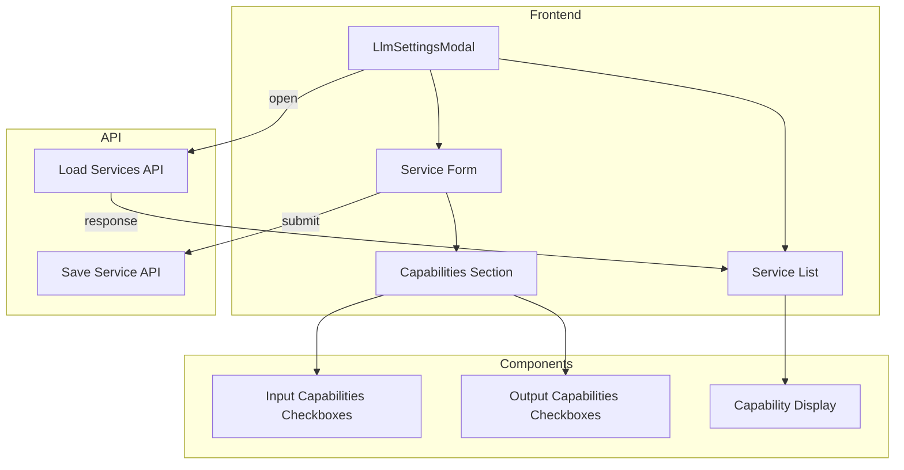

# Design Document: LLM Capabilities UI

## Overview

本设计文档描述了在 LLM 服务设置界面中添加模型能力（capabilities）配置项的技术实现方案。该功能允许用户在添加或编辑 LLM 服务时，配置模型支持的输入和输出能力类型。

核心思路是：
1. 在服务编辑表单中添加能力配置区域
2. 使用复选框组让用户选择输入/输出能力
3. 在服务列表中显示能力配置信息
4. 保存时将能力配置包含在请求中

## Architecture



## Components and Interfaces

### 1. 能力配置区域 UI 结构

在服务编辑表单中添加可折叠的能力配置区域：

```html
<!-- 能力配置区域 -->
<div class="form-group capabilities-section">
  <div class="capabilities-header">
    <label>模型能力配置</label>
    <button type="button" class="capabilities-toggle-btn">
      <span class="toggle-icon">▼</span>
    </button>
  </div>
  <div class="capabilities-content">
    <!-- 输入能力 -->
    <div class="capability-group">
      <span class="capability-group-label">输入能力</span>
      <div class="capability-checkboxes">
        <label class="capability-checkbox" title="文本对话">
          <input type="checkbox" value="text" checked>
          <span class="capability-icon">📝</span>
          <span class="capability-name">text</span>
        </label>
        <label class="capability-checkbox" title="视觉理解（图片）">
          <input type="checkbox" value="vision">
          <span class="capability-icon">👁️</span>
          <span class="capability-name">vision</span>
        </label>
        <!-- 更多能力选项... -->
      </div>
    </div>
    <!-- 输出能力 -->
    <div class="capability-group">
      <span class="capability-group-label">输出能力</span>
      <div class="capability-checkboxes">
        <!-- 输出能力选项... -->
      </div>
    </div>
  </div>
</div>
```

### 2. 标准能力类型定义

```javascript
const STANDARD_CAPABILITIES = {
  input: [
    { value: 'text', label: '文本', icon: '📝', description: '文本对话' },
    { value: 'vision', label: '视觉', icon: '👁️', description: '视觉理解（图片）' },
    { value: 'audio', label: '音频', icon: '🎵', description: '音频理解' },
    { value: 'file', label: '文件', icon: '📄', description: '文件阅读' }
  ],
  output: [
    { value: 'text', label: '文本', icon: '📝', description: '文本输出' },
    { value: 'structured_output', label: '结构化', icon: '📊', description: '结构化输出（JSON）' },
    { value: 'tool_calling', label: '工具', icon: '🔧', description: '工具调用' }
  ]
};
```

### 3. LlmSettingsModal 扩展

在现有的 `LlmSettingsModal` 组件中添加能力配置相关的方法：

```javascript
// 新增 DOM 元素引用
serviceCapabilitiesSection: null,
serviceInputCapabilities: null,
serviceOutputCapabilities: null,
capabilitiesToggleBtn: null,

// 新增方法
_createCapabilitiesSection()     // 创建能力配置区域 DOM
_bindCapabilitiesEvents()        // 绑定能力配置相关事件
_toggleCapabilitiesSection()     // 切换能力配置区域展开/折叠
_getSelectedCapabilities()       // 获取选中的能力配置
_setCapabilities(capabilities)   // 设置能力配置（编辑时回显）
_renderCapabilityDisplay(service) // 渲染服务列表中的能力显示
```

## Data Models

### 能力配置数据结构

```javascript
// 服务配置中的 capabilities 字段
{
  "id": "vision-model",
  "name": "视觉模型",
  "baseURL": "https://api.example.com/v1",
  "model": "gpt-4-vision",
  "apiKey": "xxx",
  "capabilityTags": ["视觉理解", "图像分析"],
  "capabilities": {
    "input": ["text", "vision"],
    "output": ["text", "structured_output"]
  },
  "description": "支持图片理解的模型"
}
```

### 默认能力配置

```javascript
const DEFAULT_CAPABILITIES = {
  input: ['text'],
  output: ['text']
};
```

## UI Design

### 服务列表中的能力显示

```html
<div class="llm-service-item">
  <div class="service-info">
    <div class="service-name">视觉模型</div>
    <div class="service-details">
      <span class="service-model">gpt-4-vision</span>
      <span class="service-url">https://api.example.com/v1</span>
    </div>
    <!-- 能力标签显示 -->
    <div class="service-capabilities">
      <span class="capability-badge input" title="输入: 文本">📝</span>
      <span class="capability-badge input" title="输入: 视觉">👁️</span>
      <span class="capability-divider">→</span>
      <span class="capability-badge output" title="输出: 文本">📝</span>
      <span class="capability-badge output" title="输出: 结构化">📊</span>
    </div>
  </div>
  <div class="service-actions">
    <button class="btn-icon edit-service-btn">✏️</button>
    <button class="btn-icon delete-service-btn">🗑️</button>
  </div>
</div>
```

### CSS 样式设计

```css
/* 能力配置区域 */
.capabilities-section {
  border: 1px solid #e8e8e8;
  border-radius: 4px;
  overflow: hidden;
}

.capabilities-header {
  display: flex;
  justify-content: space-between;
  align-items: center;
  padding: 10px 12px;
  background-color: #fafafa;
  cursor: pointer;
}

.capabilities-toggle-btn {
  background: none;
  border: none;
  cursor: pointer;
  font-size: 12px;
  color: #888;
  transition: transform 0.2s;
}

.capabilities-section.collapsed .capabilities-toggle-btn {
  transform: rotate(-90deg);
}

.capabilities-content {
  padding: 12px;
  border-top: 1px solid #e8e8e8;
}

.capabilities-section.collapsed .capabilities-content {
  display: none;
}

.capability-group {
  margin-bottom: 12px;
}

.capability-group:last-child {
  margin-bottom: 0;
}

.capability-group-label {
  display: block;
  font-size: 12px;
  color: #666;
  margin-bottom: 8px;
}

.capability-checkboxes {
  display: flex;
  flex-wrap: wrap;
  gap: 8px;
}

.capability-checkbox {
  display: flex;
  align-items: center;
  gap: 4px;
  padding: 6px 10px;
  background-color: #f5f5f5;
  border: 1px solid #e8e8e8;
  border-radius: 4px;
  cursor: pointer;
  transition: all 0.2s;
}

.capability-checkbox:hover {
  border-color: #07c160;
}

.capability-checkbox input:checked + .capability-icon + .capability-name {
  color: #07c160;
}

.capability-checkbox input {
  margin: 0;
}

.capability-icon {
  font-size: 14px;
}

.capability-name {
  font-size: 12px;
  color: #333;
}

/* 服务列表中的能力显示 */
.service-capabilities {
  display: flex;
  align-items: center;
  gap: 4px;
  margin-top: 8px;
}

.capability-badge {
  display: inline-flex;
  align-items: center;
  justify-content: center;
  width: 24px;
  height: 24px;
  border-radius: 4px;
  font-size: 12px;
  cursor: help;
}

.capability-badge.input {
  background-color: #e6f7ff;
}

.capability-badge.output {
  background-color: #f6ffed;
}

.capability-divider {
  color: #999;
  font-size: 12px;
  margin: 0 4px;
}
```

## Correctness Properties

*A property is a characteristic or behavior that should hold true across all valid executions of a system-essentially, a formal statement about what the system should do. Properties serve as the bridge between human-readable specifications and machine-verifiable correctness guarantees.*

### Property 1: Default Capability Selection

*For any* new service creation, the form SHALL have 'text' capability pre-selected for both input and output by default.

**Validates: Requirements 2.1**

### Property 2: Capability Persistence

*For any* service save operation, the capabilities object in the request payload SHALL contain exactly the capabilities that were selected in the form.

**Validates: Requirements 3.1, 3.2**

### Property 3: Capability Display Consistency

*For any* service displayed in the list, the capability badges shown SHALL match the capabilities stored in the service configuration.

**Validates: Requirements 4.1, 4.2, 4.3**

### Property 4: Edit Mode Capability Restoration

*For any* service being edited, the capability checkboxes SHALL reflect the exact capabilities stored in the service configuration.

**Validates: Requirements 2.3**

## Error Handling

### 表单验证

1. **无能力选择**
   - 如果用户取消所有能力选择，保存时自动添加默认的 text 能力
   - 显示提示信息告知用户

2. **API 错误**
   - 保存失败时显示错误提示
   - 保持表单状态，允许用户重试

## Testing Strategy

### 单元测试

1. **能力配置区域测试**
   - 测试默认能力选择
   - 测试能力选择/取消选择
   - 测试折叠/展开功能

2. **数据处理测试**
   - 测试 `_getSelectedCapabilities` 方法
   - 测试 `_setCapabilities` 方法
   - 测试保存时的数据格式

3. **显示测试**
   - 测试服务列表中的能力显示
   - 测试编辑时的能力回显

### 集成测试

1. 完整的添加服务流程测试
2. 完整的编辑服务流程测试
3. 能力配置的持久化验证

