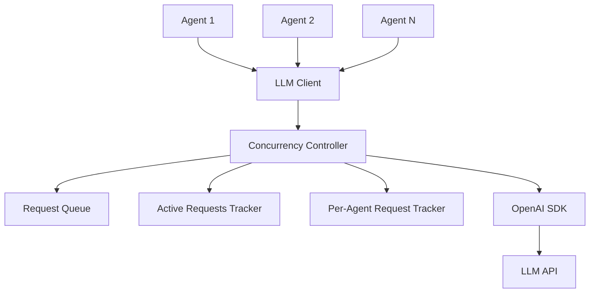

# Design Document

## Overview

本设计实现了一个LLM请求并发控制系统，通过引入并发控制器来管理多个智能体的LLM请求。系统确保：
1. 多个智能体之间可以并发发送LLM请求
2. 单个智能体的请求必须串行处理（一去一回）
3. 总并发数不超过配置的最大值
4. 当达到并发限制时，新请求会排队等待

## Architecture

系统采用分层架构，在现有LLM客户端基础上添加并发控制层：



## Components and Interfaces

### ConcurrencyController

负责管理并发请求的核心组件：

```javascript
class ConcurrencyController {
  constructor(maxConcurrentRequests = 3) {
    this.maxConcurrentRequests = maxConcurrentRequests;
    this.activeRequests = new Map(); // agentId -> request info
    this.requestQueue = []; // 等待队列
    this.activeCount = 0; // 当前活跃请求数
  }

  async executeRequest(agentId, requestFn) {
    // 检查该智能体是否已有活跃请求
    // 如果没有且未达并发限制，立即执行
    // 否则加入队列等待
  }

  _processQueue() {
    // 处理队列中的等待请求
  }

  _canExecuteRequest(agentId) {
    // 检查是否可以执行请求
  }
}
```

### Enhanced LlmClient

扩展现有的LlmClient，集成并发控制：

```javascript
class LlmClient {
  constructor(options) {
    // 现有构造函数逻辑
    this.concurrencyController = new ConcurrencyController(
      options.maxConcurrentRequests || 3
    );
  }

  async chat(input) {
    const agentId = input?.meta?.agentId;
    if (!agentId) {
      throw new Error("agentId is required for concurrent requests");
    }

    return this.concurrencyController.executeRequest(
      agentId,
      () => this._executeChatRequest(input)
    );
  }

  async _executeChatRequest(input) {
    // 现有的chat方法逻辑
  }
}
```

### Configuration Extension

扩展app.json配置结构：

```json
{
  "llm": {
    "baseURL": "http://127.0.0.1:1234/v1",
    "model": "zai-org/glm-4.6v-flash",
    "apiKey": "NOT_NEEDED",
    "maxConcurrentRequests": 3
  }
}
```

## Data Models

### RequestInfo

表示一个LLM请求的信息：

```javascript
class RequestInfo {
  constructor(agentId, requestFn, resolve, reject) {
    this.agentId = agentId;
    this.requestFn = requestFn;
    this.resolve = resolve;
    this.reject = reject;
    this.timestamp = Date.now();
    this.abortController = new AbortController();
  }
}
```

### ConcurrencyStats

并发统计信息：

```javascript
class ConcurrencyStats {
  constructor() {
    this.activeCount = 0;
    this.queueLength = 0;
    this.totalRequests = 0;
    this.completedRequests = 0;
    this.rejectedRequests = 0;
  }
}
```

## Correctness Properties

*A property is a characteristic or behavior that should hold true across all valid executions of a system-essentially, a formal statement about what the system should do. Properties serve as the bridge between human-readable specifications and machine-verifiable correctness guarantees.*

### Property 1: Configuration Loading and Validation
*For any* app.json configuration file, the system should correctly read the maxConcurrentLlmRequests value, use default value 3 when not specified, and use default value 3 with warning when invalid values are provided
**Validates: Requirements 1.1, 1.2, 1.3**

### Property 2: Dynamic Configuration Updates
*For any* runtime configuration change, the Concurrency Controller should dynamically adjust the concurrent request limit without disrupting active requests
**Validates: Requirements 1.4**

### Property 3: Concurrent Request Processing
*For any* set of agents with no active requests, when the system concurrent count is below the maximum limit, their requests should be processed immediately and independently
**Validates: Requirements 2.1, 3.2**

### Property 4: Single Agent Serial Constraint
*For any* agent that already has an active request, any subsequent request from the same agent should be immediately rejected with an error
**Validates: Requirements 2.2, 3.3**

### Property 5: Queue Management
*For any* request when the system has reached maximum concurrency, the request should enter the queue and be processed when a slot becomes available
**Validates: Requirements 2.3, 2.4, 3.4**

### Property 6: Request Cancellation and Resource Cleanup
*For any* request that is cancelled (whether queued or active), the system should properly remove it, reject its promise, release resources, and process the next queued request
**Validates: Requirements 2.5, 5.1, 5.2, 5.3, 5.4**

### Property 7: Asynchronous Non-blocking Behavior
*For any* LLM request, the chat method should return a Promise immediately without blocking the calling thread
**Validates: Requirements 3.1**

### Property 8: Error Handling and Resource Release
*For any* request that fails during processing, the system should release the concurrency slot and process the next queued request
**Validates: Requirements 3.5**

### Property 9: Statistics and Monitoring
*For any* request lifecycle event (start, complete, queue, reach limit), the system should accurately update and log the corresponding statistics
**Validates: Requirements 4.1, 4.2, 4.3, 4.4**

### Property 10: Backward Compatibility
*For any* existing code that calls LLM_Client methods, the interface should remain compatible and all existing features (retry, abort, logging) should continue to work normally
**Validates: Requirements 6.1, 6.2, 6.3, 6.4**

## Error Handling

### Request Rejection Scenarios
- **Duplicate Agent Request**: When an agent tries to make a second request while having an active one
- **Invalid Agent ID**: When a request is made without a valid agentId
- **System Shutdown**: When requests are made during system shutdown

### Failure Recovery
- **Request Timeout**: Automatic cleanup and queue processing
- **Network Failures**: Retry mechanism integration with concurrency control
- **Memory Pressure**: Queue size limits and oldest request eviction

### Graceful Degradation
- **Configuration Errors**: Fall back to default values with warnings
- **Queue Overflow**: Reject new requests with appropriate error messages
- **Resource Exhaustion**: Temporary request rejection with retry suggestions

## Testing Strategy

### Dual Testing Approach
The system will be validated using both unit tests and property-based tests:

**Unit Tests** will focus on:
- Specific configuration scenarios (missing config, invalid values)
- Edge cases (system shutdown, queue overflow)
- Integration points between components
- Error conditions and recovery

**Property-Based Tests** will focus on:
- Universal properties across all request scenarios
- Concurrent behavior validation across multiple agents
- Queue management correctness under various loads
- Resource cleanup verification across all failure modes

### Property-Based Testing Configuration
- **Testing Framework**: fast-check for JavaScript property-based testing
- **Minimum Iterations**: 100 iterations per property test
- **Test Tagging**: Each property test will reference its design document property
- **Tag Format**: **Feature: llm-concurrency-control, Property {number}: {property_text}**

### Test Environment Setup
- **Mock LLM API**: Controllable response times and failure scenarios
- **Configurable Delays**: Simulate various network conditions
- **Agent Simulation**: Multiple concurrent agent instances
- **Resource Monitoring**: Track memory usage and cleanup verification