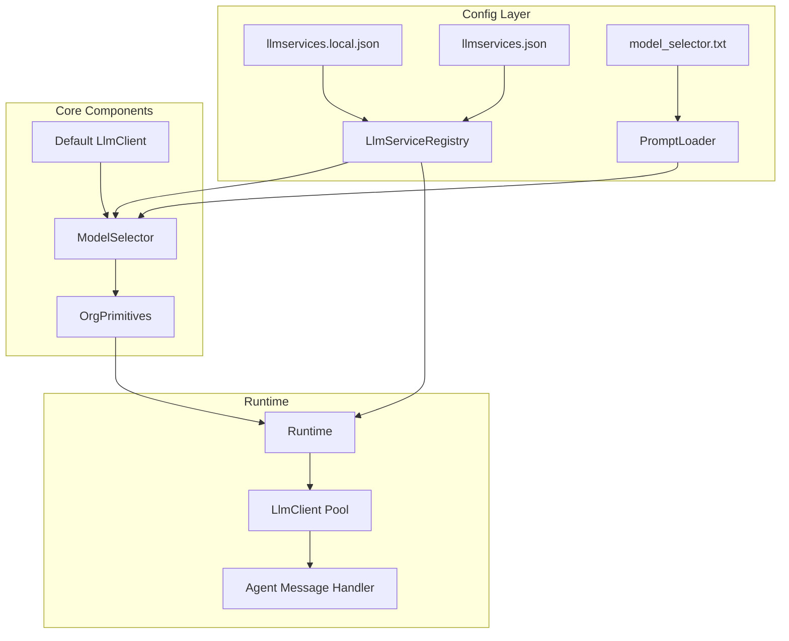

# Design Document: LLM Service Selector

## Overview

本设计实现多场景化大模型服务选择功能，允许系统根据岗位职责自动选择最合适的大模型服务。核心思路是：
1. 通过配置文件定义多个具有不同能力标签的大模型服务
2. 在创建岗位时，使用默认大模型分析岗位提示词，智能匹配最合适的服务
3. 智能体运行时根据岗位配置使用对应的大模型服务

## Architecture



## Components and Interfaces

### 1. LlmServiceRegistry

负责加载和管理多个大模型服务配置。

```javascript
/**
 * LLM 服务注册表
 */
class LlmServiceRegistry {
  /**
   * @param {{configDir: string, logger?: object}} options
   */
  constructor(options) {}

  /**
   * 加载服务配置（优先 local 文件）
   * @returns {Promise<{loaded: boolean, services: LlmServiceConfig[]}>}
   */
  async load() {}

  /**
   * 获取所有可用服务
   * @returns {LlmServiceConfig[]}
   */
  getServices() {}

  /**
   * 根据 ID 获取服务
   * @param {string} serviceId
   * @returns {LlmServiceConfig | null}
   */
  getServiceById(serviceId) {}

  /**
   * 检查是否有可用服务
   * @returns {boolean}
   */
  hasServices() {}
}

/**
 * @typedef {Object} LlmServiceConfig
 * @property {string} id - 服务唯一标识
 * @property {string} name - 服务名称
 * @property {string} baseURL - API 基础 URL
 * @property {string} model - 模型名称
 * @property {string} apiKey - API 密钥
 * @property {string[]} capabilityTags - 能力标签（如 "视觉理解", "编程", "高智能"）
 * @property {string} description - 服务描述
 * @property {number} [maxConcurrentRequests] - 最大并发请求数
 */
```

### 2. ModelSelector

负责根据岗位提示词选择合适的大模型服务。

```javascript
/**
 * 模型选择器
 */
class ModelSelector {
  /**
   * @param {{
   *   llmClient: LlmClient,
   *   serviceRegistry: LlmServiceRegistry,
   *   promptTemplate: string,
   *   logger?: object
   * }} options
   */
  constructor(options) {}

  /**
   * 根据岗位提示词选择合适的模型服务
   * @param {string} rolePrompt - 岗位提示词
   * @returns {Promise<{serviceId: string | null, reason: string}>}
   */
  async selectService(rolePrompt) {}

  /**
   * 构建选择提示词
   * @param {string} rolePrompt
   * @param {LlmServiceConfig[]} services
   * @returns {string}
   */
  _buildSelectionPrompt(rolePrompt, services) {}

  /**
   * 解析 LLM 返回的选择结果
   * @param {string} response
   * @returns {{serviceId: string | null, reason: string}}
   */
  _parseSelectionResult(response) {}
}
```

### 3. 扩展 OrgPrimitives

在岗位数据中增加 llmServiceId 字段。

```javascript
/**
 * 创建岗位（扩展）
 * @param {{name: string, rolePrompt: string, createdBy?: string, llmServiceId?: string}} input
 * @returns {Promise<{id: string, name: string, rolePrompt: string, llmServiceId: string | null}>}
 */
async createRole(input) {}
```

### 4. 扩展 Runtime

支持多 LlmClient 实例管理和岗位创建时的模型选择。

```javascript
/**
 * Runtime 扩展
 */
class Runtime {
  // 新增属性
  /** @type {LlmServiceRegistry} */
  serviceRegistry;
  
  /** @type {ModelSelector} */
  modelSelector;
  
  /** @type {Map<string, LlmClient>} */
  llmClientPool;

  /**
   * 获取指定服务的 LlmClient（懒加载）
   * @param {string} serviceId
   * @returns {LlmClient}
   */
  getLlmClientForService(serviceId) {}

  /**
   * 获取智能体应使用的 LlmClient
   * @param {string} agentId
   * @returns {LlmClient}
   */
  getLlmClientForAgent(agentId) {}
}
```

## Data Models

### llmservices.json 配置文件格式

```json
{
  "services": [
    {
      "id": "vision-model",
      "name": "视觉理解模型",
      "baseURL": "http://127.0.0.1:1234/v1",
      "model": "vision-model-name",
      "apiKey": "NOT_NEEDED",
      "capabilityTags": ["视觉理解", "图像分析", "多模态"],
      "description": "专门用于图像内容理解和分析的模型",
      "maxConcurrentRequests": 2
    },
    {
      "id": "coding-model",
      "name": "编程模型",
      "baseURL": "http://127.0.0.1:1234/v1",
      "model": "coding-model-name",
      "apiKey": "NOT_NEEDED",
      "capabilityTags": ["编程", "代码生成", "代码审查"],
      "description": "专门用于代码生成和编程任务的模型",
      "maxConcurrentRequests": 3
    },
    {
      "id": "low-cost-model",
      "name": "低成本模型",
      "baseURL": "http://127.0.0.1:1234/v1",
      "model": "low-cost-model-name",
      "apiKey": "NOT_NEEDED",
      "capabilityTags": ["低成本", "快速响应", "简单任务"],
      "description": "适用于简单任务的低成本快速模型",
      "maxConcurrentRequests": 5
    }
  ]
}
```

### model_selector.txt 提示词模板

```text
你是一个模型选择助手。根据岗位职责描述，从可用的大模型服务中选择最合适的一个。

## 岗位提示词
{{ROLE_PROMPT}}

## 可用的大模型服务
{{SERVICES_LIST}}

## 任务
分析岗位提示词的职责要求，选择最匹配的大模型服务。

## 输出格式
请以 JSON 格式输出选择结果：
```json
{
  "serviceId": "选中的服务ID",
  "reason": "选择该服务的原因"
}
```

如果没有合适的服务，serviceId 设为 null。
```

### Role 数据结构扩展

```javascript
{
  id: "uuid",
  name: "岗位名称",
  rolePrompt: "岗位提示词",
  createdBy: "创建者ID",
  createdAt: "2026-01-09T10:00:00.000+08:00",
  status: "active",
  llmServiceId: "vision-model"  // 新增字段，可选
}
```

## Correctness Properties

*A property is a characteristic or behavior that should hold true across all valid executions of a system-essentially, a formal statement about what the system should do. Properties serve as the bridge between human-readable specifications and machine-verifiable correctness guarantees.*

### Property 1: 配置文件加载优先级

*For any* 配置加载场景，当 llmservices.local.json 和 llmservices.json 都存在时，系统应加载 local 文件的内容；当仅 llmservices.json 存在时，系统应加载该文件的内容。

**Validates: Requirements 1.1, 1.2**

### Property 2: 服务配置字段完整性

*For any* 有效的服务配置条目，加载后应包含 id、name、baseURL、model、apiKey、capabilityTags 和 description 所有字段，且值与配置文件中一致。

**Validates: Requirements 1.4**

### Property 3: 无效条目过滤

*For any* 包含有效和无效条目的配置文件，加载后的服务列表应仅包含有效条目，无效条目应被跳过。

**Validates: Requirements 1.5**

### Property 4: 服务 ID 查询一致性

*For any* 已加载的服务配置，通过 getServiceById 查询应返回与原始配置相同的服务对象；查询不存在的 ID 应返回 null。

**Validates: Requirements 1.6**

### Property 5: 空配置跳过选择

*For any* 岗位创建操作，当服务注册表为空时，模型选择器应返回 null 且不调用 LLM 进行选择。

**Validates: Requirements 3.2**

### Property 6: 选择结果解析与验证

*For any* LLM 返回的选择结果，当 serviceId 在注册表中存在时应返回该 ID；当 serviceId 无效或不存在时应返回 null。

**Validates: Requirements 3.4, 3.5**

### Property 7: 岗位 llmServiceId 持久化往返

*For any* 创建的岗位（包含或不包含 llmServiceId），持久化后重新加载应得到相同的 llmServiceId 值（包括 null/undefined 情况）。

**Validates: Requirements 5.1, 5.2, 5.3**

### Property 8: LlmClient 池实例复用

*For any* 服务 ID，首次调用 getLlmClientForService 应创建新实例，后续调用相同 ID 应返回相同实例引用。

**Validates: Requirements 4.4**

### Property 9: LlmClient 回退逻辑

*For any* 智能体消息处理，当岗位未指定 llmServiceId 或指定的服务不可用时，应使用默认 LlmClient。

**Validates: Requirements 4.2, 4.3**

## Error Handling

### 配置加载错误

| 错误场景 | 处理方式 |
|---------|---------|
| 配置文件不存在 | 使用空服务列表，记录 info 日志 |
| JSON 解析失败 | 使用空服务列表，记录 error 日志 |
| 服务条目缺少必填字段 | 跳过该条目，记录 warn 日志 |

### 模型选择错误

| 错误场景 | 处理方式 |
|---------|---------|
| LLM 调用失败 | 返回 null，记录 error 日志 |
| LLM 返回格式错误 | 返回 null，记录 warn 日志 |
| 选择的服务 ID 无效 | 返回 null，记录 warn 日志 |

### 运行时错误

| 错误场景 | 处理方式 |
|---------|---------|
| 岗位指定的服务不可用 | 使用默认 LlmClient，记录 warn 日志 |
| LlmClient 创建失败 | 使用默认 LlmClient，记录 error 日志 |

## Testing Strategy

### 单元测试

1. **LlmServiceRegistry 测试**
   - 测试配置文件加载优先级
   - 测试空配置处理
   - 测试无效条目过滤
   - 测试服务查询功能

2. **ModelSelector 测试**
   - 测试空服务列表跳过逻辑
   - 测试提示词构建
   - 测试结果解析
   - 测试异常处理

3. **OrgPrimitives 扩展测试**
   - 测试 llmServiceId 字段存储
   - 测试持久化和加载

4. **Runtime 扩展测试**
   - 测试 LlmClient 池管理
   - 测试智能体模型获取

### 属性测试

使用 fast-check 进行属性测试，每个属性测试运行至少 100 次迭代。

| 属性 | 测试策略 |
|-----|---------|
| Property 1: 配置文件加载优先级 | 生成随机配置内容，创建 local 和非 local 文件，验证加载结果 |
| Property 2: 服务配置字段完整性 | 生成随机有效服务配置，验证加载后字段一致 |
| Property 3: 无效条目过滤 | 生成混合有效/无效条目的配置，验证过滤结果 |
| Property 4: 服务 ID 查询一致性 | 生成随机服务配置，验证 ID 查询返回正确结果 |
| Property 5: 空配置跳过选择 | 使用空注册表，验证不调用 LLM |
| Property 6: 选择结果解析与验证 | 生成随机 LLM 响应，验证解析和验证逻辑 |
| Property 7: 岗位 llmServiceId 持久化往返 | 生成随机岗位数据，验证持久化往返一致性 |
| Property 8: LlmClient 池实例复用 | 多次调用相同 ID，验证返回相同实例 |
| Property 9: LlmClient 回退逻辑 | 测试各种回退场景，验证使用默认客户端 |

测试标签格式: **Feature: llm-service-selector, Property {number}: {property_text}**
