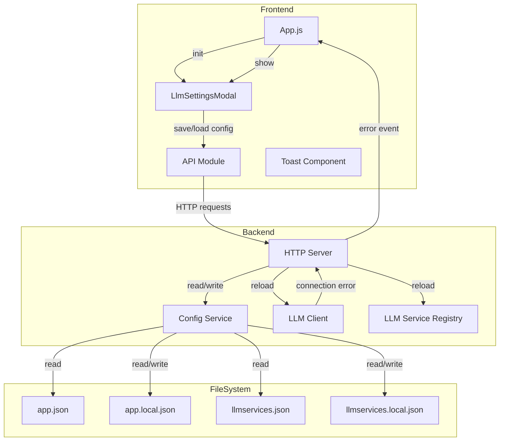

# Design Document: LLM Settings Page

## Overview

本设计文档描述大模型（LLM）设置页面的技术实现方案。该功能允许用户：
1. 配置默认 LLM 连接参数
2. 管理多个 LLM 服务（添加、修改、删除）
3. 所有配置修改即刻生效

页面在首次启动或连接错误时自动弹出。

系统采用前后端分离架构：
- 前端：基于现有的 Web 组件模式，创建 `LlmSettingsModal` 组件
- 后端：在 `HTTPServer` 中添加配置相关的 API 端点，`ConfigService` 处理文件操作

## Architecture



## Components and Interfaces

### 1. LlmSettingsModal (Frontend Component)

前端模态对话框组件，负责显示和收集 LLM 配置。

```javascript
/**
 * LLM 设置模态框组件
 */
const LlmSettingsModal = {
  // 状态
  isOpen: false,
  errorMessage: null,
  config: null,
  
  /**
   * 初始化组件
   */
  init() { },
  
  /**
   * 打开设置对话框
   * @param {object} options - 可选参数
   * @param {string} options.errorMessage - 错误消息（连接错误时显示）
   */
  open(options = {}) { },
  
  /**
   * 关闭设置对话框
   */
  close() { },
  
  /**
   * 加载当前配置
   * @returns {Promise<void>}
   */
  async loadConfig() { },
  
  /**
   * 保存配置
   * @returns {Promise<boolean>} 是否保存成功
   */
  async saveConfig() { },
  
  /**
   * 验证表单输入
   * @returns {{valid: boolean, errors: object}}
   */
  validate() { },
  
  /**
   * 渲染模态框 HTML
   */
  render() { }
};
```

### 2. API Module Extensions

扩展现有的 API 模块，添加配置相关的方法。

```javascript
// 添加到 web/js/api.js
const API = {
  // ... 现有方法 ...
  
  /**
   * 获取 LLM 配置
   * @returns {Promise<{llm: LlmConfig, source: string}>}
   */
  async getLlmConfig() {
    return this.get('/config/llm');
  },
  
  /**
   * 保存 LLM 配置
   * @param {LlmConfig} config - LLM 配置
   * @returns {Promise<{ok: boolean, llm: LlmConfig}>}
   */
  async saveLlmConfig(config) {
    return this.post('/config/llm', config);
  },
  
  /**
   * 获取配置状态
   * @returns {Promise<{hasLocalConfig: boolean, llmStatus: string}>}
   */
  async getConfigStatus() {
    return this.get('/config/status');
  },
  
  /**
   * 获取所有 LLM 服务
   * @returns {Promise<{services: LlmService[], source: string}>}
   */
  async getLlmServicesConfig() {
    return this.get('/config/llm-services');
  },
  
  /**
   * 添加 LLM 服务
   * @param {LlmService} service - LLM 服务配置
   * @returns {Promise<{ok: boolean, service: LlmService}>}
   */
  async addLlmService(service) {
    return this.post('/config/llm-services', service);
  },
  
  /**
   * 更新 LLM 服务
   * @param {string} serviceId - 服务 ID
   * @param {LlmService} service - LLM 服务配置
   * @returns {Promise<{ok: boolean, service: LlmService}>}
   */
  async updateLlmService(serviceId, service) {
    return this.post(`/config/llm-services/${encodeURIComponent(serviceId)}`, service);
  },
  
  /**
   * 删除 LLM 服务
   * @param {string} serviceId - 服务 ID
   * @returns {Promise<{ok: boolean}>}
   */
  async deleteLlmService(serviceId) {
    return this.delete(`/config/llm-services/${encodeURIComponent(serviceId)}`);
  }
};
```

### 3. HTTP Server API Endpoints

在 `HTTPServer` 中添加新的 API 端点。

#### GET /api/config/llm

获取当前 LLM 配置。

**Response:**
```json
{
  "llm": {
    "baseURL": "http://127.0.0.1:1234/v1",
    "model": "gpt-4",
    "apiKey": "****1234",
    "maxConcurrentRequests": 2
  },
  "source": "local"
}
```

#### POST /api/config/llm

保存 LLM 配置。

**Request:**
```json
{
  "baseURL": "http://127.0.0.1:1234/v1",
  "model": "gpt-4",
  "apiKey": "sk-xxx",
  "maxConcurrentRequests": 2
}
```

**Response (Success):**
```json
{
  "ok": true,
  "llm": {
    "baseURL": "http://127.0.0.1:1234/v1",
    "model": "gpt-4",
    "apiKey": "****xxx",
    "maxConcurrentRequests": 2
  }
}
```

**Response (Validation Error):**
```json
{
  "error": "validation_error",
  "details": {
    "baseURL": "baseURL is required",
    "model": "model is required"
  }
}
```

#### GET /api/config/status

获取配置状态。

**Response:**
```json
{
  "hasLocalConfig": true,
  "llmStatus": "connected",
  "lastError": null
}
```

#### GET /api/config/llm-services

获取所有 LLM 服务配置。

**Response:**
```json
{
  "services": [
    {
      "id": "max-model",
      "name": "最强文本模型",
      "baseURL": "https://open.bigmodel.cn/api/coding/paas/v4",
      "model": "GLM-4.7",
      "apiKey": "****X7p",
      "maxConcurrentRequests": 2,
      "capabilityTags": ["逻辑推理", "编程"],
      "description": "默认最贵、最强的模型"
    }
  ],
  "source": "local"
}
```

#### POST /api/config/llm-services

添加新的 LLM 服务。

**Request:**
```json
{
  "id": "new-model",
  "name": "新模型",
  "baseURL": "https://api.example.com/v1",
  "model": "model-name",
  "apiKey": "sk-xxx",
  "maxConcurrentRequests": 2,
  "capabilityTags": ["编程"],
  "description": "描述"
}
```

**Response (Success):**
```json
{
  "ok": true,
  "service": { ... }
}
```

#### POST /api/config/llm-services/:serviceId

更新现有 LLM 服务。

**Request:** 同添加服务

**Response (Success):**
```json
{
  "ok": true,
  "service": { ... }
}
```

#### DELETE /api/config/llm-services/:serviceId

删除 LLM 服务。

**Response (Success):**
```json
{
  "ok": true,
  "deletedId": "service-id"
}
```

### 4. Config Service

配置服务模块，负责读取和保存配置文件。

```javascript
/**
 * 配置服务
 */
export class ConfigService {
  /**
   * @param {string} configDir - 配置目录路径
   */
  constructor(configDir) { }
  
  /**
   * 检查本地配置文件是否存在
   * @returns {boolean}
   */
  hasLocalConfig() { }
  
  /**
   * 获取 LLM 配置
   * @returns {Promise<{llm: object, source: string}>}
   */
  async getLlmConfig() { }
  
  /**
   * 保存 LLM 配置
   * @param {object} llmConfig - LLM 配置
   * @returns {Promise<void>}
   */
  async saveLlmConfig(llmConfig) { }
  
  /**
   * 获取所有 LLM 服务配置
   * @returns {Promise<{services: object[], source: string}>}
   */
  async getLlmServices() { }
  
  /**
   * 添加 LLM 服务
   * @param {object} service - 服务配置
   * @returns {Promise<object>}
   */
  async addLlmService(service) { }
  
  /**
   * 更新 LLM 服务
   * @param {string} serviceId - 服务 ID
   * @param {object} service - 服务配置
   * @returns {Promise<object>}
   */
  async updateLlmService(serviceId, service) { }
  
  /**
   * 删除 LLM 服务
   * @param {string} serviceId - 服务 ID
   * @returns {Promise<void>}
   */
  async deleteLlmService(serviceId) { }
  
  /**
   * 掩码 API Key
   * @param {string} apiKey - 原始 API Key
   * @returns {string} 掩码后的 API Key
   */
  maskApiKey(apiKey) { }
}
```

## Data Models

### LlmConfig

```typescript
interface LlmConfig {
  baseURL: string;      // LLM 服务的基础 URL
  model: string;        // 模型名称
  apiKey: string;       // API 密钥
  maxConcurrentRequests: number;  // 最大并发请求数
}
```

### LlmService

```typescript
interface LlmService {
  id: string;           // 服务唯一标识
  name: string;         // 服务显示名称
  baseURL: string;      // LLM 服务的基础 URL
  model: string;        // 模型名称
  apiKey: string;       // API 密钥
  maxConcurrentRequests: number;  // 最大并发请求数
  capabilityTags: string[];  // 能力标签
  description: string;  // 服务描述
}
```

### ConfigStatus

```typescript
interface ConfigStatus {
  hasLocalConfig: boolean;  // 是否存在本地配置文件
  llmStatus: 'connected' | 'disconnected' | 'error';  // LLM 连接状态
  lastError: string | null;  // 最后一次错误消息
}
```

## Correctness Properties

*A property is a characteristic or behavior that should hold true across all valid executions of a system-essentially, a formal statement about what the system should do. Properties serve as the bridge between human-readable specifications and machine-verifiable correctness guarantees.*

### Property 1: Config Pre-population

*For any* valid LLM configuration object, when the settings modal is opened, all input fields SHALL be pre-populated with the corresponding configuration values.

**Validates: Requirements 1.2, 8.2**

### Property 2: Validation Rejects Empty Required Fields

*For any* input where baseURL or model is empty or whitespace-only, the validation function SHALL return invalid with appropriate error messages.

**Validates: Requirements 1.3, 6.2, 10.2**

### Property 3: Auto-open Based on Config Existence

*For any* application startup, the settings modal SHALL automatically open if and only if app.local.json does not exist.

**Validates: Requirements 2.1, 2.2**

### Property 4: Auto-open on Connection Error

*For any* LLM connection error event, the settings modal SHALL automatically open and display the error message.

**Validates: Requirements 3.1, 3.2**

### Property 5: Config Save Preserves Non-LLM Fields

*For any* save operation, all configuration fields outside the `llm` section SHALL remain unchanged in app.local.json.

**Validates: Requirements 4.2, 4.3**

### Property 6: API Key Masking

*For any* API key string with length >= 4, the masked version SHALL show only the last 4 characters prefixed with "****". For shorter strings, the entire key SHALL be masked as "****".

**Validates: Requirements 5.2, 6.5, 9.5**

### Property 7: Config Source Priority

*For any* config read operation, the system SHALL return configuration from app.local.json if it exists, otherwise from app.json. Similarly for llmservices.local.json vs llmservices.json.

**Validates: Requirements 5.3**

### Property 8: Service ID Uniqueness

*For any* add service operation, if a service with the same ID already exists, the operation SHALL fail with an appropriate error.

**Validates: Requirements 10.5**

### Property 9: Immediate Config Reload

*For any* configuration save operation (default LLM or service), the corresponding client/registry SHALL immediately use the new settings without requiring application restart.

**Validates: Requirements 13.1, 13.2**

## Error Handling

### Frontend Error Handling

1. **Network Errors**: 显示 Toast 错误消息，保持模态框打开
2. **Validation Errors**: 在对应输入字段下方显示错误提示
3. **Save Failures**: 显示错误消息，保持模态框打开供用户修正
4. **Duplicate Service ID**: 显示错误消息，提示用户修改 ID

### Backend Error Handling

1. **File Read Errors**: 返回 500 错误，包含错误详情
2. **File Write Errors**: 返回 500 错误，包含错误详情
3. **Validation Errors**: 返回 400 错误，包含验证失败的字段详情
4. **Service Not Found**: 返回 404 错误
5. **Duplicate Service ID**: 返回 409 错误

### LLM Connection Error Handling

1. 在 `LlmClient` 中捕获连接错误
2. 通过 `HTTPServer` 记录错误状态
3. 前端轮询 `/api/config/status` 检测错误
4. 检测到错误时自动打开设置页面

## Testing Strategy

### Unit Tests

使用 Vitest 进行单元测试：

1. **ConfigService Tests**
   - 测试 `hasLocalConfig()` 正确检测文件存在性
   - 测试 `getLlmConfig()` 正确读取配置
   - 测试 `saveLlmConfig()` 正确保存配置
   - 测试 `maskApiKey()` 正确掩码 API Key
   - 测试 `getLlmServices()` 正确读取服务列表
   - 测试 `addLlmService()` 正确添加服务
   - 测试 `updateLlmService()` 正确更新服务
   - 测试 `deleteLlmService()` 正确删除服务

2. **Validation Tests**
   - 测试空 baseURL 验证失败
   - 测试空 model 验证失败
   - 测试有效配置验证通过
   - 测试重复 service ID 验证失败

3. **API Endpoint Tests**
   - 测试 GET /api/config/llm 返回正确格式
   - 测试 POST /api/config/llm 验证逻辑
   - 测试 GET /api/config/status 返回正确状态
   - 测试 GET /api/config/llm-services 返回服务列表
   - 测试 POST /api/config/llm-services 添加服务
   - 测试 POST /api/config/llm-services/:id 更新服务
   - 测试 DELETE /api/config/llm-services/:id 删除服务

### Property-Based Tests

使用 fast-check 进行属性测试，每个测试运行至少 100 次迭代：

1. **Property 2: Validation Rejects Empty Required Fields**
   - 生成随机字符串，验证空/空白字符串被拒绝

2. **Property 5: Config Save Preserves Non-LLM Fields**
   - 生成随机配置对象，验证保存后非 LLM 字段不变

3. **Property 6: API Key Masking**
   - 生成随机长度的 API Key，验证掩码规则

4. **Property 7: Config Source Priority**
   - 测试不同文件存在组合下的配置源选择

5. **Property 8: Service ID Uniqueness**
   - 生成随机服务配置，验证重复 ID 被拒绝
