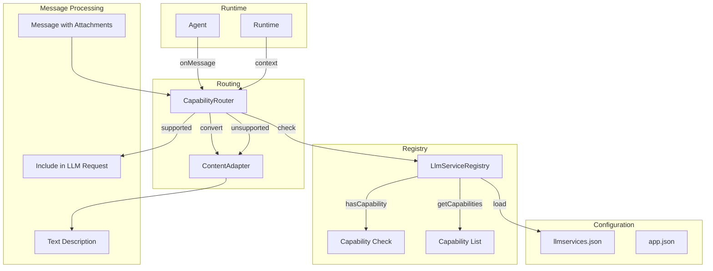

# Design Document: Model Capability Routing

## Overview

本设计文档描述了模型能力路由功能的技术实现方案。该功能通过在配置文件中定义模型的输入输出能力，使系统能够在运行时根据模型能力智能地处理不同类型的消息内容。

核心思路是：
1. 扩展 `llmservices.json` 配置格式，添加结构化的能力描述
2. 在 `LlmServiceRegistry` 中添加能力查询方法
3. 创建 `CapabilityRouter` 组件，根据模型能力决定如何处理消息
4. 创建 `ContentAdapter` 组件，将不支持的内容转换为文本描述

## Architecture



## Components and Interfaces

### 1. Capability Configuration Schema

扩展 `llmservices.json` 中的服务配置，添加 `capabilities` 对象：

```typescript
interface ModelCapabilities {
  input: CapabilityType[];   // 支持的输入类型
  output: CapabilityType[];  // 支持的输出类型
}

type CapabilityType = 
  | 'text'              // 文本对话
  | 'vision'            // 视觉理解（图片）
  | 'audio'             // 音频理解
  | 'file'              // 文件阅读
  | 'structured_output' // 结构化输出
  | 'tool_calling'      // 工具调用
  | string;             // 支持自定义能力类型

interface LlmServiceConfig {
  id: string;
  name: string;
  baseURL: string;
  model: string;
  apiKey: string;
  capabilityTags: string[];  // 保留现有字段，用于模型选择
  capabilities?: ModelCapabilities;  // 新增：结构化能力描述
  description: string;
}
```

### 2. LlmServiceRegistry 扩展

在现有的 `LlmServiceRegistry` 类中添加能力查询方法：

```typescript
class LlmServiceRegistry {
  // 现有方法...
  
  /**
   * 检查服务是否支持指定能力
   * @param serviceId - 服务ID
   * @param capabilityType - 能力类型
   * @param direction - 方向：'input' | 'output' | 'both'
   * @returns boolean
   */
  hasCapability(serviceId: string, capabilityType: string, direction?: 'input' | 'output' | 'both'): boolean;
  
  /**
   * 获取服务的所有能力
   * @param serviceId - 服务ID
   * @returns ModelCapabilities | null
   */
  getCapabilities(serviceId: string): ModelCapabilities | null;
  
  /**
   * 根据能力类型查询支持的服务
   * @param capabilityType - 能力类型
   * @param direction - 方向
   * @returns LlmServiceConfig[]
   */
  getServicesByCapability(capabilityType: string, direction?: 'input' | 'output' | 'both'): LlmServiceConfig[];
}
```

### 3. CapabilityRouter 组件

新建 `src/platform/capability_router.js`：

```typescript
interface RoutingResult {
  canProcess: boolean;           // 是否可以直接处理
  processedContent: any;         // 处理后的内容（多模态或文本）
  unsupportedAttachments: AttachmentInfo[];  // 不支持的附件列表
  textDescription?: string;      // 不支持内容的文本描述
}

interface AttachmentInfo {
  type: 'image' | 'audio' | 'file';
  artifactRef: string;
  filename: string;
  size?: number;
  mimeType?: string;
}

class CapabilityRouter {
  constructor(options: {
    serviceRegistry: LlmServiceRegistry;
    contentAdapter: ContentAdapter;
    logger?: Logger;
  });
  
  /**
   * 根据模型能力路由消息内容
   * @param message - 原始消息
   * @param serviceId - 当前使用的服务ID
   * @returns RoutingResult
   */
  async routeContent(message: Message, serviceId: string): Promise<RoutingResult>;
  
  /**
   * 检查消息是否包含需要特殊能力的内容
   * @param message - 消息对象
   * @returns 需要的能力类型列表
   */
  getRequiredCapabilities(message: Message): CapabilityType[];
}
```

### 4. ContentAdapter 组件

新建 `src/platform/content_adapter.js`：

```typescript
interface AdaptedContent {
  text: string;           // 转换后的文本描述
  structuredInfo: {       // 结构化信息（便于解析）
    contentType: 'image' | 'audio' | 'file';
    artifactRef: string;
    filename?: string;
    size?: number;
    mimeType?: string;
    suggestedAgents?: string[];  // 建议转发的智能体
  };
}

class ContentAdapter {
  constructor(options: {
    serviceRegistry: LlmServiceRegistry;
    agentRegistry?: AgentRegistry;  // 用于查询具备能力的智能体
    logger?: Logger;
  });
  
  /**
   * 将不支持的内容转换为文本描述
   * @param attachment - 附件信息
   * @returns AdaptedContent
   */
  adaptToText(attachment: AttachmentInfo): AdaptedContent;
  
  /**
   * 批量转换多个附件
   * @param attachments - 附件列表
   * @returns AdaptedContent[]
   */
  adaptMultiple(attachments: AttachmentInfo[]): AdaptedContent[];
  
  /**
   * 查询具备指定能力的智能体
   * @param capabilityType - 能力类型
   * @returns string[] - 智能体ID列表
   */
  findCapableAgents(capabilityType: CapabilityType): string[];
}
```

## Data Models

### 配置文件示例

```json
{
  "services": [
    {
      "id": "text-model",
      "name": "纯文本模型",
      "baseURL": "https://api.example.com/v1",
      "model": "gpt-4",
      "apiKey": "xxx",
      "capabilityTags": ["文本对话", "工具调用"],
      "capabilities": {
        "input": ["text"],
        "output": ["text", "structured_output", "tool_calling"]
      },
      "description": "纯文本对话模型"
    },
    {
      "id": "vision-model",
      "name": "视觉模型",
      "baseURL": "https://api.example.com/v1",
      "model": "gpt-4-vision",
      "apiKey": "xxx",
      "capabilityTags": ["视觉理解", "图像分析"],
      "capabilities": {
        "input": ["text", "vision"],
        "output": ["text", "structured_output"]
      },
      "description": "支持图片理解的模型"
    },
    {
      "id": "multimodal-model",
      "name": "多模态模型",
      "baseURL": "https://api.example.com/v1",
      "model": "gemini-pro",
      "apiKey": "xxx",
      "capabilityTags": ["多模态", "视觉理解", "音频理解"],
      "capabilities": {
        "input": ["text", "vision", "audio", "file"],
        "output": ["text", "structured_output", "tool_calling"]
      },
      "description": "支持多种输入类型的模型"
    }
  ]
}
```

### 转换后的文本描述格式

```
【收到附件】
类型: 图片
文件名: screenshot.png
工件ID: artifact:abc123-def456
文件大小: 1.2 MB
MIME类型: image/png

当前模型不支持直接处理此类型内容。
如需处理此图片，可以使用 send_message 工具将其转发给具备视觉理解能力的智能体。
建议转发给: vision-agent, multimodal-agent
```

## Correctness Properties

*A property is a characteristic or behavior that should hold true across all valid executions of a system-essentially, a formal statement about what the system should do. Properties serve as the bridge between human-readable specifications and machine-verifiable correctness guarantees.*

### Property 1: Configuration Validation

*For any* LLM service configuration with a `capabilities` object, the system SHALL validate that:
- The `capabilities` object contains `input` and/or `output` arrays
- Each capability type in the arrays is a non-empty string
- Invalid configurations are rejected with descriptive error messages

**Validates: Requirements 1.1, 1.2, 1.4**

### Property 2: Capability Routing for Supported Types

*For any* message containing attachments (image, audio, or file) AND a model that supports the corresponding capability type in its `input` capabilities, the CapabilityRouter SHALL include the attachment data in the processed content for the LLM request.

**Validates: Requirements 2.1, 2.3, 2.5**

### Property 3: Fallback Conversion for Unsupported Types

*For any* message containing attachments (image, audio, or file) AND a model that does NOT support the corresponding capability type, the CapabilityRouter SHALL convert the attachment to a text description and NOT include the raw attachment data.

**Validates: Requirements 2.2, 2.4, 2.6**

### Property 4: Content Adapter Output Completeness

*For any* content conversion performed by ContentAdapter, the output text SHALL contain:
- The artifact reference ID
- The content type (image/audio/file)
- The filename (if available in the original attachment)
- The file size (if available)
- A suggestion to forward to capable agents

**Validates: Requirements 3.1, 3.2, 3.3, 3.4, 3.5**

### Property 5: Structured Output Format

*For any* content conversion, the ContentAdapter output SHALL be parseable as structured data, containing all required fields in a consistent format that can be programmatically extracted.

**Validates: Requirements 3.6**

### Property 6: Backward Compatibility

*For any* existing LLM service configuration that lacks the `capabilities` field, the system SHALL:
- Successfully load the configuration without errors
- Default to `text` capability for both input and output
- Maintain all existing functionality

**Validates: Requirements 1.5, 5.2**

### Property 7: Capability Query API Correctness

*For any* capability query operation:
- `hasCapability(serviceId, type, 'input')` returns true if and only if the service's `input` array contains the type
- `hasCapability(serviceId, type, 'output')` returns true if and only if the service's `output` array contains the type
- `hasCapability(serviceId, type, 'both')` returns true if and only if both arrays contain the type
- `getCapabilities(serviceId)` returns the exact capabilities object from configuration

**Validates: Requirements 4.1, 4.2, 6.1, 6.2, 6.4**

## Error Handling

### 配置加载错误

1. **无效的 capabilities 格式**
   - 记录警告日志，包含具体的验证错误
   - 回退到默认的 text 能力
   - 不阻止服务加载

2. **未知的能力类型**
   - 接受自定义能力类型（不做限制）
   - 记录 debug 日志以便追踪

### 运行时错误

1. **服务ID不存在**
   - `hasCapability` 返回 false
   - `getCapabilities` 返回 null
   - 记录警告日志

2. **附件读取失败**
   - 在文本描述中标注读取失败
   - 仍然提供 artifact reference 供后续重试

## Testing Strategy

### 单元测试

1. **LlmServiceRegistry 能力方法测试**
   - 测试 `hasCapability` 各种参数组合
   - 测试 `getCapabilities` 返回值
   - 测试配置加载和验证

2. **CapabilityRouter 测试**
   - 测试各种消息类型的路由决策
   - 测试多附件消息的处理
   - 测试边界情况（空消息、无附件等）

3. **ContentAdapter 测试**
   - 测试各种内容类型的转换
   - 测试输出格式的正确性
   - 测试缺失字段的处理

### 属性测试

使用 fast-check 进行属性测试，每个属性测试至少运行 100 次迭代。

1. **Property 1 测试**: 生成随机配置，验证验证逻辑
2. **Property 2 测试**: 生成随机消息和能力配置，验证路由行为
3. **Property 3 测试**: 生成随机消息和不支持的能力配置，验证转换行为
4. **Property 4 测试**: 生成随机附件信息，验证输出完整性
5. **Property 5 测试**: 验证输出可解析性
6. **Property 6 测试**: 使用现有配置格式，验证兼容性
7. **Property 7 测试**: 生成随机能力查询，验证API正确性

### 集成测试

1. 端到端测试：从消息接收到 LLM 调用的完整流程
2. 配置热加载测试：验证配置更新后能力检查的正确性
