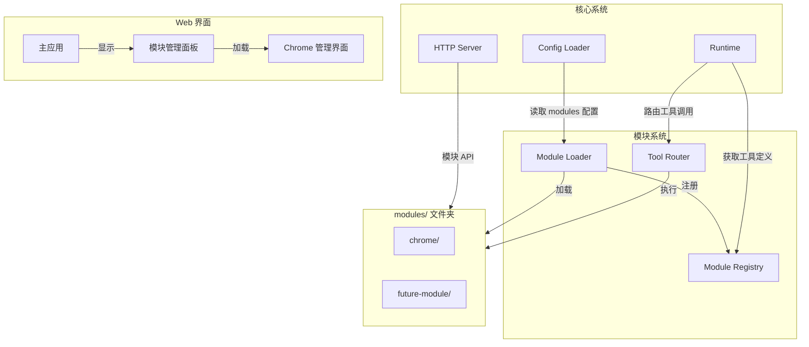
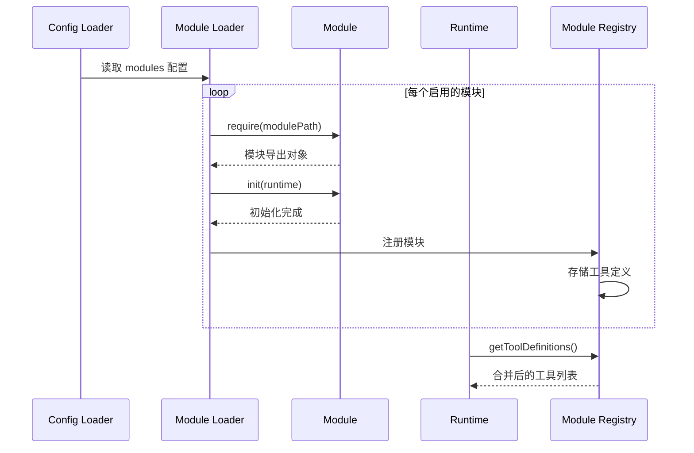
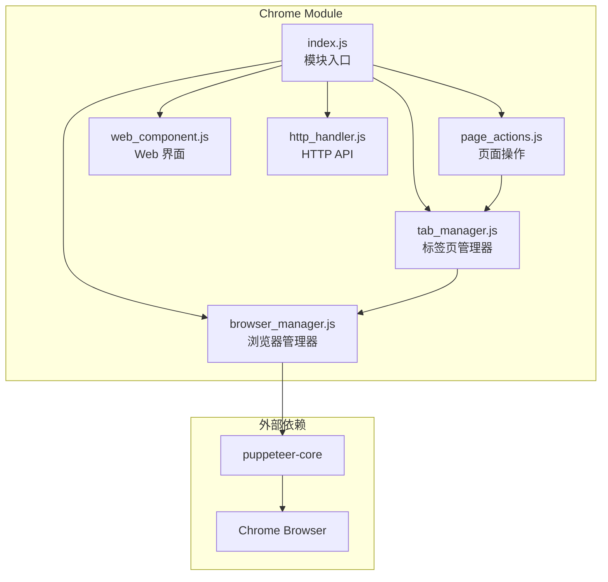

# Design Document: Module System

## Overview

本设计文档描述了一个可插拔模块系统的架构，该系统允许通过配置文件动态启用独立模块，为智能体添加新的工具函数。模块系统采用松耦合设计，模块代码独立于核心代码存放在 `modules` 文件夹中。

第一个实现的模块是 Chrome 浏览器控制模块，提供无头浏览器操作能力，包括浏览器管理、标签页管理、页面导航、内容读取和页面交互等功能。

## Architecture

### 系统架构图



### 模块加载流程



## Components and Interfaces

### 1. Module Loader (模块加载器)

负责从 `modules` 文件夹加载和初始化模块。

```javascript
// src/platform/module_loader.js

/**
 * 模块加载器：负责加载、初始化和管理可插拔模块
 */
export class ModuleLoader {
  /**
   * @param {{logger?: any, modulesDir?: string}} options
   */
  constructor(options = {}) {
    this.log = options.logger ?? createNoopModuleLogger();
    this.modulesDir = options.modulesDir ?? path.resolve(process.cwd(), "modules");
    this._modules = new Map(); // moduleName -> moduleInstance
    this._runtime = null;
  }

  /**
   * 加载配置中启用的模块
   * @param {string[]} enabledModules - 启用的模块名称列表
   * @param {Runtime} runtime - 运行时实例
   * @returns {Promise<{loaded: string[], errors: Array<{module: string, error: string}>}>}
   */
  async loadModules(enabledModules, runtime) { }

  /**
   * 获取所有已加载模块的工具定义
   * @returns {Array<{type: string, function: object}>}
   */
  getToolDefinitions() { }

  /**
   * 执行模块工具调用
   * @param {any} ctx - 调用上下文
   * @param {string} toolName - 工具名称
   * @param {any} args - 工具参数
   * @returns {Promise<any>}
   */
  async executeToolCall(ctx, toolName, args) { }

  /**
   * 获取所有已加载模块的 Web 组件定义
   * @returns {Array<{moduleName: string, component: object}>}
   */
  getWebComponents() { }

  /**
   * 获取模块的 HTTP 路由处理器
   * @param {string} moduleName - 模块名称
   * @returns {Function|null}
   */
  getModuleHttpHandler(moduleName) { }

  /**
   * 关闭所有模块
   * @returns {Promise<void>}
   */
  async shutdown() { }
}
```

### 2. Module Interface (模块接口规范)

每个模块必须遵循的接口规范：

```javascript
// modules/example/index.js

/**
 * 模块接口规范
 */
export default {
  /** 模块唯一标识符 */
  name: "example",

  /**
   * 初始化模块
   * @param {Runtime} runtime - 运行时实例
   * @returns {Promise<void>}
   */
  async init(runtime) { },

  /**
   * 获取工具定义列表
   * @returns {Array<{type: string, function: object}>}
   */
  getToolDefinitions() { },

  /**
   * 执行工具调用
   * @param {any} ctx - 调用上下文
   * @param {string} toolName - 工具名称
   * @param {any} args - 工具参数
   * @returns {Promise<any>}
   */
  async executeToolCall(ctx, toolName, args) { },

  /**
   * 获取 Web 管理界面组件定义（可选）
   * @returns {object|null}
   */
  getWebComponent() { },

  /**
   * 获取 HTTP API 路由处理器（可选）
   * @returns {Function|null}
   */
  getHttpHandler() { },

  /**
   * 关闭模块并释放资源
   * @returns {Promise<void>}
   */
  async shutdown() { }
};
```

### 3. Chrome Module (Chrome 浏览器模块)

Chrome 模块的内部架构：



#### Chrome Module 文件结构

```
modules/
└── chrome/
    ├── index.js           # 模块入口
    ├── browser_manager.js # 浏览器实例管理
    ├── tab_manager.js     # 标签页管理
    ├── page_actions.js    # 页面操作（导航、截图、交互）
    ├── tools.js           # 工具定义
    ├── http_handler.js    # HTTP API 处理器
    └── web/
        ├── component.js   # Web 组件定义
        ├── panel.html     # 管理面板 HTML
        └── panel.css      # 管理面板样式
```

### 4. Configuration Extension (配置扩展)

app.json 配置文件扩展：

```json
{
  "promptsDir": "config/prompts",
  "artifactsDir": "data/runtime/artifacts",
  "runtimeDir": "data/runtime/state",
  "loggingConfigPath": "config/logging.json",
  "maxSteps": 200,
  "llm": { ... },
  "modules": ["chrome"]
}
```

## Data Models

### Browser Instance (浏览器实例)

```javascript
/**
 * @typedef {object} BrowserInstance
 * @property {string} id - 浏览器实例唯一 ID
 * @property {Browser} browser - Puppeteer Browser 对象
 * @property {string} createdAt - 创建时间 ISO 字符串
 * @property {string} status - 状态: 'running' | 'closed'
 */
```

### Tab (标签页)

```javascript
/**
 * @typedef {object} Tab
 * @property {string} id - 标签页唯一 ID
 * @property {string} browserId - 所属浏览器实例 ID
 * @property {Page} page - Puppeteer Page 对象
 * @property {string} url - 当前 URL
 * @property {string} title - 页面标题
 * @property {string} createdAt - 创建时间 ISO 字符串
 * @property {string} status - 状态: 'active' | 'closed'
 */
```

### Module State (模块状态)

```javascript
/**
 * @typedef {object} ModuleState
 * @property {string} name - 模块名称
 * @property {string} status - 状态: 'loaded' | 'initialized' | 'error' | 'shutdown'
 * @property {string} loadedAt - 加载时间
 * @property {string|null} error - 错误信息
 * @property {number} toolCount - 提供的工具数量
 */
```

### Web Component Definition (Web 组件定义)

```javascript
/**
 * @typedef {object} WebComponentDefinition
 * @property {string} moduleName - 模块名称
 * @property {string} displayName - 显示名称
 * @property {string} icon - 图标（emoji 或 URL）
 * @property {string} panelHtml - 面板 HTML 内容
 * @property {string} panelCss - 面板 CSS 样式
 * @property {string} panelJs - 面板 JavaScript 代码
 */
```

## Correctness Properties

*A property is a characteristic or behavior that should hold true across all valid executions of a system-essentially, a formal statement about what the system should do. Properties serve as the bridge between human-readable specifications and machine-verifiable correctness guarantees.*


### Property 1: Module Interface Validation (模块接口验证)

*For any* module in the modules folder, if it is loaded by the Module_System, it SHALL export all required interface members: `name` (string), `getToolDefinitions` (function), `executeToolCall` (function), `init` (async function), and `shutdown` (async function).

**Validates: Requirements 2.1, 2.2, 2.3, 2.4, 2.5**

### Property 2: Configuration-Driven Module Loading (配置驱动的模块加载)

*For any* configuration with a `modules` array, the Module_System SHALL load exactly and only the modules listed in the array. Modules not in the array SHALL NOT be loaded.

**Validates: Requirements 1.2, 3.1, 3.2**

### Property 3: Tool Definition Collection (工具定义收集)

*For any* set of loaded modules, the combined tool definitions returned by `getToolDefinitions()` SHALL contain all tools from all loaded modules, with no duplicates and no missing tools.

**Validates: Requirements 1.4, 1.5**

### Property 4: Tool Call Routing (工具调用路由)

*For any* tool call request where the tool name matches a module-provided tool, the Module_System SHALL route the call to the correct module's `executeToolCall` function and return its result.

**Validates: Requirements 1.6**

### Property 5: Module Load Failure Isolation (模块加载失败隔离)

*For any* set of modules where some modules fail to load, the Module_System SHALL successfully load all non-failing modules and record errors for failing modules.

**Validates: Requirements 1.7**

### Property 6: Browser Lifecycle Management (浏览器生命周期管理)

*For any* browser instance created via `chrome_launch`, the instance SHALL have a unique ID, be trackable via the module's state, and be properly closed and cleaned up when `chrome_close` is called or when the module shuts down.

**Validates: Requirements 4.1, 4.2, 4.3, 4.5**

### Property 7: Tab Lifecycle Management (标签页生命周期管理)

*For any* tab created via `chrome_new_tab`, the tab SHALL have a unique ID, be associated with its parent browser, appear in `chrome_list_tabs` results, and be properly closed when `chrome_close_tab` is called.

**Validates: Requirements 5.1, 5.2, 5.3, 5.4**

### Property 8: Navigation Round-Trip (导航往返一致性)

*For any* valid URL, after calling `chrome_navigate` with that URL, calling `chrome_get_url` SHALL return a URL that matches the navigation target (accounting for redirects).

**Validates: Requirements 6.1, 6.2, 6.5**

### Property 9: Content Retrieval Consistency (内容获取一致性)

*For any* page with content, `chrome_screenshot` SHALL return valid Base64-encoded image data, `chrome_get_content` SHALL return non-empty HTML, and `chrome_get_text` SHALL return text content that is a subset of the HTML content.

**Validates: Requirements 7.1, 7.3, 7.4**

### Property 10: Page Interaction Effects (页面交互效果)

*For any* page with interactive elements, `chrome_click` on a clickable element SHALL trigger the element's click handler, `chrome_type` SHALL append text to the focused element, `chrome_fill` SHALL replace the element's value, and `chrome_evaluate` SHALL execute JavaScript and return its result.

**Validates: Requirements 8.1, 8.2, 8.3, 8.4**

### Property 11: CSS Selector Element Location (CSS 选择器元素定位)

*For any* valid CSS selector that matches elements on the page, the Chrome_Module SHALL correctly locate and operate on those elements. For selectors that match no elements, the module SHALL return an appropriate error.

**Validates: Requirements 7.5, 8.5, 8.6**

### Property 12: Error Structure Consistency (错误结构一致性)

*For any* tool call that fails, the returned error object SHALL contain `error` (string type), `message` (string description), and relevant context fields.

**Validates: Requirements 11.3, 11.4**

### Property 13: Module HTTP API Availability (模块 HTTP API 可用性)

*For any* loaded module that provides an HTTP handler, the Module_System SHALL register the handler and make it accessible via the HTTP server at the module's designated path.

**Validates: Requirements 9.4**

### Property 14: Web Component Registration (Web 组件注册)

*For any* loaded module that provides a Web component via `getWebComponent()`, the Module_System SHALL collect and make the component definition available for the main UI to render.

**Validates: Requirements 9.1, 9.2**

## Error Handling

### Module Loading Errors

| Error Type | Condition | Handling |
|------------|-----------|----------|
| `module_not_found` | 模块文件夹不存在 | 记录警告日志，跳过该模块 |
| `invalid_module_interface` | 模块缺少必需的导出 | 记录错误日志，跳过该模块 |
| `module_init_failed` | 模块初始化抛出异常 | 记录错误日志，标记模块为错误状态 |
| `duplicate_tool_name` | 多个模块定义同名工具 | 记录警告日志，后加载的覆盖先加载的 |

### Chrome Module Errors

| Error Type | Condition | Handling |
|------------|-----------|----------|
| `browser_launch_failed` | Chrome 启动失败 | 返回错误信息，包含失败原因 |
| `browser_not_found` | 指定的浏览器实例不存在 | 返回 `{ error: "browser_not_found", browserId }` |
| `tab_not_found` | 指定的标签页不存在 | 返回 `{ error: "tab_not_found", tabId }` |
| `navigation_timeout` | 页面导航超时 | 返回 `{ error: "navigation_timeout", url, timeoutMs }` |
| `element_not_found` | CSS 选择器未匹配到元素 | 返回 `{ error: "element_not_found", selector }` |
| `evaluate_error` | JavaScript 执行出错 | 返回 `{ error: "evaluate_error", message }` |
| `screenshot_failed` | 截图失败 | 返回 `{ error: "screenshot_failed", message }` |

### Error Response Format

```javascript
{
  error: "error_type",        // 错误类型标识符
  message: "Human readable",  // 人类可读的错误描述
  // 相关上下文字段
  browserId?: "...",
  tabId?: "...",
  selector?: "...",
  url?: "..."
}
```

## Testing Strategy

### Unit Tests

单元测试覆盖以下场景：

1. **Module Loader Tests**
   - 加载有效模块
   - 跳过无效模块
   - 配置为空时不加载任何模块
   - 工具定义合并
   - 工具调用路由

2. **Chrome Module Tests**
   - 浏览器启动和关闭
   - 标签页创建和关闭
   - 页面导航
   - 内容获取
   - 页面交互
   - 错误处理

### Property-Based Tests

使用 fast-check 库进行属性测试，最少 100 次迭代：

1. **Property 1**: 模块接口验证 - 生成随机模块结构，验证接口检查逻辑
2. **Property 2**: 配置驱动加载 - 生成随机模块列表和配置，验证加载行为
3. **Property 3**: 工具定义收集 - 生成随机工具定义，验证合并逻辑
4. **Property 4**: 工具调用路由 - 生成随机工具调用，验证路由正确性
5. **Property 5**: 失败隔离 - 生成包含失败模块的列表，验证隔离行为
6. **Property 12**: 错误结构 - 生成各种错误场景，验证错误格式

### Integration Tests

集成测试需要实际的 Chrome 浏览器环境：

1. 完整的浏览器生命周期测试
2. 多标签页并发操作测试
3. 页面交互端到端测试
4. Web 管理界面功能测试

### Test Configuration

```javascript
// 属性测试配置
{
  numRuns: 100,           // 最少 100 次迭代
  seed: Date.now(),       // 可重现的随机种子
  verbose: true           // 详细输出
}
```

## Chrome Module Tool Definitions

### chrome_launch

```javascript
{
  type: "function",
  function: {
    name: "chrome_launch",
    description: "启动一个新的 Chrome 无头浏览器实例",
    parameters: {
      type: "object",
      properties: {
        headless: { 
          type: "boolean", 
          description: "是否使用无头模式，默认 true" 
        },
        args: { 
          type: "array", 
          items: { type: "string" },
          description: "Chrome 启动参数" 
        }
      }
    }
  }
}
```

### chrome_close

```javascript
{
  type: "function",
  function: {
    name: "chrome_close",
    description: "关闭指定的浏览器实例",
    parameters: {
      type: "object",
      properties: {
        browserId: { type: "string", description: "浏览器实例 ID" }
      },
      required: ["browserId"]
    }
  }
}
```

### chrome_new_tab

```javascript
{
  type: "function",
  function: {
    name: "chrome_new_tab",
    description: "在指定浏览器中创建新标签页",
    parameters: {
      type: "object",
      properties: {
        browserId: { type: "string", description: "浏览器实例 ID" },
        url: { type: "string", description: "初始 URL（可选）" }
      },
      required: ["browserId"]
    }
  }
}
```

### chrome_close_tab

```javascript
{
  type: "function",
  function: {
    name: "chrome_close_tab",
    description: "关闭指定的标签页",
    parameters: {
      type: "object",
      properties: {
        tabId: { type: "string", description: "标签页 ID" }
      },
      required: ["tabId"]
    }
  }
}
```

### chrome_list_tabs

```javascript
{
  type: "function",
  function: {
    name: "chrome_list_tabs",
    description: "列出指定浏览器的所有标签页",
    parameters: {
      type: "object",
      properties: {
        browserId: { type: "string", description: "浏览器实例 ID" }
      },
      required: ["browserId"]
    }
  }
}
```

### chrome_navigate

```javascript
{
  type: "function",
  function: {
    name: "chrome_navigate",
    description: "导航到指定 URL",
    parameters: {
      type: "object",
      properties: {
        tabId: { type: "string", description: "标签页 ID" },
        url: { type: "string", description: "目标 URL" },
        waitUntil: { 
          type: "string", 
          enum: ["load", "domcontentloaded", "networkidle0", "networkidle2"],
          description: "等待条件，默认 load" 
        },
        timeoutMs: { type: "number", description: "超时时间（毫秒），默认 30000" }
      },
      required: ["tabId", "url"]
    }
  }
}
```

### chrome_get_url

```javascript
{
  type: "function",
  function: {
    name: "chrome_get_url",
    description: "获取标签页当前 URL",
    parameters: {
      type: "object",
      properties: {
        tabId: { type: "string", description: "标签页 ID" }
      },
      required: ["tabId"]
    }
  }
}
```

### chrome_screenshot

```javascript
{
  type: "function",
  function: {
    name: "chrome_screenshot",
    description: "获取页面截图",
    parameters: {
      type: "object",
      properties: {
        tabId: { type: "string", description: "标签页 ID" },
        fullPage: { type: "boolean", description: "是否全页面截图，默认 false" },
        selector: { type: "string", description: "截取特定元素（CSS 选择器）" }
      },
      required: ["tabId"]
    }
  }
}
```

### chrome_get_content

```javascript
{
  type: "function",
  function: {
    name: "chrome_get_content",
    description: "获取页面 HTML 内容",
    parameters: {
      type: "object",
      properties: {
        tabId: { type: "string", description: "标签页 ID" },
        selector: { type: "string", description: "获取特定元素的 HTML（CSS 选择器）" }
      },
      required: ["tabId"]
    }
  }
}
```

### chrome_get_text

```javascript
{
  type: "function",
  function: {
    name: "chrome_get_text",
    description: "获取页面纯文本内容",
    parameters: {
      type: "object",
      properties: {
        tabId: { type: "string", description: "标签页 ID" },
        selector: { type: "string", description: "获取特定元素的文本（CSS 选择器）" }
      },
      required: ["tabId"]
    }
  }
}
```

### chrome_click

```javascript
{
  type: "function",
  function: {
    name: "chrome_click",
    description: "点击页面元素",
    parameters: {
      type: "object",
      properties: {
        tabId: { type: "string", description: "标签页 ID" },
        selector: { type: "string", description: "元素 CSS 选择器" },
        waitForSelector: { type: "boolean", description: "是否等待元素出现，默认 true" },
        timeoutMs: { type: "number", description: "等待超时（毫秒），默认 5000" }
      },
      required: ["tabId", "selector"]
    }
  }
}
```

### chrome_type

```javascript
{
  type: "function",
  function: {
    name: "chrome_type",
    description: "在元素中输入文本（追加模式）",
    parameters: {
      type: "object",
      properties: {
        tabId: { type: "string", description: "标签页 ID" },
        selector: { type: "string", description: "元素 CSS 选择器" },
        text: { type: "string", description: "要输入的文本" },
        delay: { type: "number", description: "按键间隔（毫秒），默认 0" }
      },
      required: ["tabId", "selector", "text"]
    }
  }
}
```

### chrome_fill

```javascript
{
  type: "function",
  function: {
    name: "chrome_fill",
    description: "清空输入框并填入新文本",
    parameters: {
      type: "object",
      properties: {
        tabId: { type: "string", description: "标签页 ID" },
        selector: { type: "string", description: "元素 CSS 选择器" },
        value: { type: "string", description: "要填入的值" }
      },
      required: ["tabId", "selector", "value"]
    }
  }
}
```

### chrome_evaluate

```javascript
{
  type: "function",
  function: {
    name: "chrome_evaluate",
    description: "在页面上下文中执行 JavaScript 代码",
    parameters: {
      type: "object",
      properties: {
        tabId: { type: "string", description: "标签页 ID" },
        script: { type: "string", description: "要执行的 JavaScript 代码" }
      },
      required: ["tabId", "script"]
    }
  }
}
```

### chrome_wait_for

```javascript
{
  type: "function",
  function: {
    name: "chrome_wait_for",
    description: "等待元素出现或满足条件",
    parameters: {
      type: "object",
      properties: {
        tabId: { type: "string", description: "标签页 ID" },
        selector: { type: "string", description: "等待的元素 CSS 选择器" },
        state: { 
          type: "string", 
          enum: ["attached", "detached", "visible", "hidden"],
          description: "等待的状态，默认 visible" 
        },
        timeoutMs: { type: "number", description: "超时时间（毫秒），默认 30000" }
      },
      required: ["tabId", "selector"]
    }
  }
}
```

## HTTP API Endpoints

### Module System Endpoints

| Method | Path | Description |
|--------|------|-------------|
| GET | `/api/modules` | 获取所有已加载模块列表 |
| GET | `/api/modules/:name` | 获取指定模块详情 |
| GET | `/api/modules/:name/web-component` | 获取模块的 Web 组件定义 |

### Chrome Module Endpoints

| Method | Path | Description |
|--------|------|-------------|
| GET | `/api/modules/chrome/browsers` | 获取所有浏览器实例列表 |
| GET | `/api/modules/chrome/browsers/:id` | 获取指定浏览器详情 |
| GET | `/api/modules/chrome/browsers/:id/tabs` | 获取浏览器的标签页列表 |
| GET | `/api/modules/chrome/tabs/:id/screenshot` | 获取标签页截图 |
| POST | `/api/modules/chrome/browsers/:id/close` | 关闭浏览器实例 |
| POST | `/api/modules/chrome/tabs/:id/close` | 关闭标签页 |

## Web Component Structure

### Chrome Module Panel

```html
<!-- modules/chrome/web/panel.html -->
<div class="chrome-module-panel">
  <div class="panel-header">
    <h3>🌐 Chrome 浏览器管理</h3>
    <button class="refresh-btn" onclick="ChromePanel.refresh()">刷新</button>
  </div>
  
  <div class="browser-list">
    <!-- 浏览器实例列表 -->
  </div>
  
  <div class="tab-preview">
    <!-- 标签页预览区域 -->
  </div>
</div>
```

### Panel JavaScript API

```javascript
// modules/chrome/web/component.js
const ChromePanel = {
  async refresh() { },
  async loadBrowsers() { },
  async loadTabs(browserId) { },
  async showTabScreenshot(tabId) { },
  async closeBrowser(browserId) { },
  async closeTab(tabId) { }
};
```
