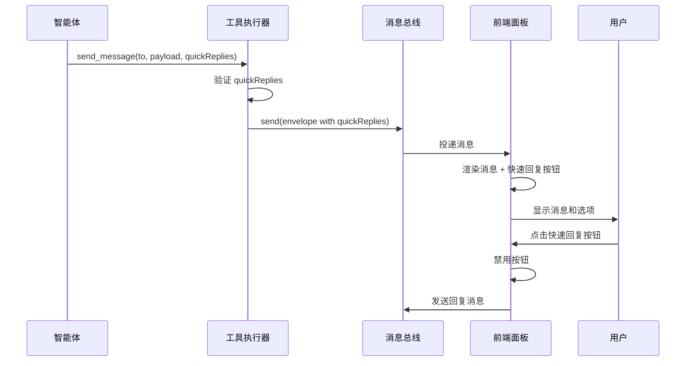

# Design Document: Quick Reply Options

## Overview

本设计为 `send_message` 工具函数添加可选的快速回复建议功能。智能体在发送消息时可以附带一个字符串数组作为快速回复建议，收件方（特别是用户）可以从中选择一个选项快速回复，也可以完全忽略这些建议自行编写回复内容。这些选项只是建议，不是必选项。

## Architecture

### 数据流



### 组件职责

1. **ToolExecutor**: 验证 `quickReplies` 参数，将其传递给 MessageBus
2. **MessageBus**: 透传 `quickReplies` 作为 payload 的一部分
3. **ChatPanel**: 渲染快速回复按钮，处理用户点击事件

## Components and Interfaces

### 1. send_message 工具参数扩展

```javascript
// 工具定义更新
{
  type: "function",
  function: {
    name: "send_message",
    description: "发送异步消息。from 默认使用当前智能体 id。",
    parameters: {
      type: "object",
      properties: {
        to: { type: "string" },
        payload: { type: "object" },
        delayMs: { 
          type: "number", 
          description: "延迟投递时间（毫秒）" 
        },
        quickReplies: {
          type: "array",
          items: { type: "string" },
          maxItems: 10,
          description: "可选的快速回复建议列表。这些只是建议选项，收件方可以从中选择一个快速回复，也可以完全忽略这些建议自行编写回复内容。最多10个选项。"
        }
      },
      required: ["to", "payload"]
    }
  }
}
```

### 2. 验证逻辑

```javascript
// 在 _executeSendMessage 中添加验证
function validateQuickReplies(quickReplies) {
  // 未提供或空数组，视为无效（忽略）
  if (!quickReplies || !Array.isArray(quickReplies) || quickReplies.length === 0) {
    return { valid: true, quickReplies: null };
  }
  
  // 长度检查
  if (quickReplies.length > 10) {
    return { valid: false, error: "quickReplies_too_many", message: "快速回复选项不能超过10个" };
  }
  
  // 元素类型检查
  for (let i = 0; i < quickReplies.length; i++) {
    const item = quickReplies[i];
    if (typeof item !== "string") {
      return { valid: false, error: "quickReplies_invalid_type", message: `快速回复选项[${i}]必须是字符串` };
    }
    if (item.trim() === "") {
      return { valid: false, error: "quickReplies_empty_string", message: `快速回复选项[${i}]不能为空` };
    }
  }
  
  return { valid: true, quickReplies };
}
```

### 3. 消息传递

```javascript
// payload 结构
{
  text: "可以从以下选择一个选项，或者也可以回复其他内容：",
  // ... 其他字段
  quickReplies: ["选项1", "选项2", "选项3"]
}
```

### 4. 前端渲染

```javascript
// ChatPanel 中添加快速回复按钮渲染
renderQuickReplies(message) {
  const quickReplies = message.payload?.quickReplies;
  if (!Array.isArray(quickReplies) || quickReplies.length === 0) {
    return '';
  }
  
  const messageId = message.id;
  const buttons = quickReplies.map((text, idx) => `
    <button 
      class="quick-reply-btn" 
      data-message-id="${messageId}"
      data-reply-text="${this.escapeHtml(text)}"
      onclick="ChatPanel.handleQuickReply('${messageId}', '${this.escapeHtml(text)}')"
    >
      ${this.escapeHtml(text)}
    </button>
  `).join('');
  
  return `<div class="quick-replies" data-message-id="${messageId}">${buttons}</div>`;
}
```

## Data Models

### QuickReplies 数据结构

```typescript
// 快速回复选项（简单字符串数组）
type QuickReplies = string[];

// 消息 payload 扩展
interface MessagePayload {
  text?: string;
  // ... 其他现有字段
  quickReplies?: QuickReplies;
}
```

### 前端状态管理

```javascript
// 记录已使用的快速回复消息
const usedQuickReplies = new Set(); // 存储已点击快速回复的消息 ID
```

## Correctness Properties

*A property is a characteristic or behavior that should hold true across all valid executions of a system-essentially, a formal statement about what the system should do. Properties serve as the bridge between human-readable specifications and machine-verifiable correctness guarantees.*

### Property 1: 输入验证完整性

*For any* `quickReplies` 输入，如果它不是字符串数组、包含非字符串元素、包含空字符串、或长度超过10，验证函数应返回错误；否则应返回有效结果。

**Validates: Requirements 1.2, 1.3, 1.5, 1.6**

### Property 2: 消息传递完整性

*For any* 包含有效 `quickReplies` 的消息，发送后接收端获取的 `quickReplies` 数组应与发送时完全相同（内容和顺序）。

**Validates: Requirements 2.1, 2.2, 2.3**

### Property 3: UI 渲染顺序一致性

*For any* 包含 `quickReplies` 的消息，渲染后的按钮顺序应与数组顺序一致。

**Validates: Requirements 3.2**

## Error Handling

### 验证错误

| 错误码 | 描述 | 处理方式 |
|--------|------|----------|
| `quickReplies_too_many` | 选项数量超过10个 | 返回错误，不发送消息 |
| `quickReplies_invalid_type` | 数组元素不是字符串 | 返回错误，不发送消息 |
| `quickReplies_empty_string` | 数组包含空字符串 | 返回错误，不发送消息 |

### 前端错误处理

- 如果 `quickReplies` 格式异常，静默忽略，不显示按钮
- 如果发送回复失败，显示 Toast 提示，恢复按钮可点击状态

## Testing Strategy

### 单元测试

1. **验证函数测试**
   - 测试空数组处理
   - 测试超长数组拒绝
   - 测试非字符串元素拒绝
   - 测试空字符串拒绝
   - 测试有效输入通过

2. **工具定义测试**
   - 验证 schema 包含 quickReplies 参数
   - 验证参数为可选
   - 验证 maxItems 约束

### 属性测试

使用 fast-check 进行属性测试：

1. **输入验证属性测试** (Property 1)
   - 生成各种类型的输入，验证验证函数行为正确

2. **消息传递属性测试** (Property 2)
   - 生成有效的 quickReplies 数组，验证发送和接收一致性

### 集成测试

1. **端到端流程测试**
   - 智能体发送带 quickReplies 的消息
   - 用户界面正确显示按钮
   - 用户点击按钮发送回复
   - 按钮正确禁用

### 测试框架

- 单元测试和属性测试：使用项目现有的测试框架（Bun test）
- 属性测试库：fast-check
