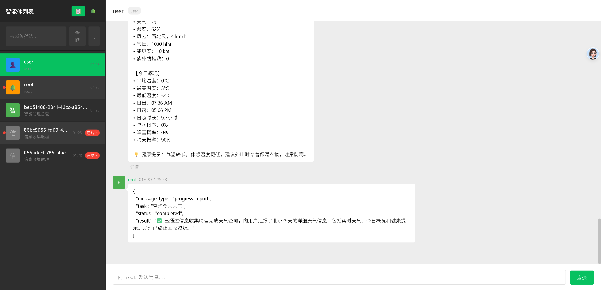
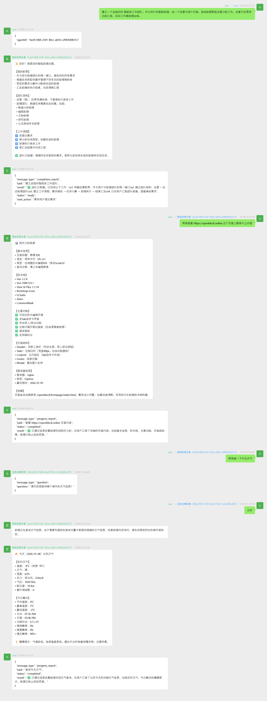

# 快速入门指南

本指南将帮助你快速上手 Agent Society，从安装配置到运行第一个多智能体协作任务。



## 目录

- [环境准备](#环境准备)
- [安装](#安装)
- [配置](#配置)
- [第一个示例](#第一个示例)
- [理解输出](#理解输出)
- [下一步](#下一步)

## 环境准备

### 运行时环境

Agent Society 推荐使用 [Bun](https://bun.sh/) 作为运行时，也支持 Node.js (>= 18)。

**安装 Bun（推荐）：**

```bash
# macOS / Linux
curl -fsSL https://bun.sh/install | bash

# Windows (PowerShell)
powershell -c "irm bun.sh/install.ps1 | iex"
```

### LLM 服务

Agent Society 需要一个兼容 OpenAI API 的 LLM 服务。你可以选择：

1. **本地 LLM**（推荐开发测试）
   - [LM Studio](https://lmstudio.ai/) - 图形界面，易于使用
   - [Ollama](https://ollama.ai/) - 命令行工具
   - [vLLM](https://github.com/vllm-project/vllm) - 高性能推理

2. **云端 API**
   - OpenAI API
   - Azure OpenAI
   - 其他兼容 OpenAI API 的服务（如 DeepSeek, Moonshot 等）

## 安装

```bash
# 克隆仓库
git clone https://github.com/your-org/agent-society.git
cd agent-society

# 安装依赖
bun install
# 或使用 npm
npm install
```

## 配置

### 1. 主配置文件 (`config/app.json`)

这是系统的核心配置文件，控制运行时行为、默认 LLM 和上下文限制。

```json
{
  "promptsDir": "config/prompts",
  "artifactsDir": "data/runtime/artifacts",
  "runtimeDir": "data/runtime/state",
  "loggingConfigPath": "config/logging.json",
  "maxSteps": 200,
  "maxToolRounds": 20000,
  "llm": {
    "baseURL": "http://127.0.0.1:1234/v1",
    "model": "your-model-name",
    "apiKey": "your-api-key-or-NOT_NEEDED",
    "maxConcurrentRequests": 5
  },
  "contextLimit": {
    "maxTokens": 12000,
    "warningThreshold": 0.7,
    "criticalThreshold": 0.9,
    "hardLimitThreshold": 0.95
  },
  "modules": {
    "chrome": {
      "headless": true
    }
  }
}
```

**配置项说明：**

| 配置项 | 说明 | 默认值 |
|--------|------|--------|
| `llm` | 默认 LLM 服务配置 | - |
| `maxSteps` | 消息循环最大步数 | `200` |
| `maxToolRounds` | 单次 LLM 调用最大工具轮次 | `200` |
| `contextLimit` | 上下文长度限制与警告阈值 | - |
| `modules` | 启用的外部模块列表 | `[]` |

### 2. 多模型服务配置 (`config/llmservices.json`)

**（可选）** 如果你需要让不同的岗位使用不同的模型（例如：让"架构师"用 GPT-4，"程序员"用本地 Qwen-7B），可以配置此文件。

```json{
  "services": [
    {
      "id": "vision-model",
      "name": "视觉理解模型",
      "baseURL": "http://127.0.0.1:1234/v1",
      "model": "vision-model-name",
      "apiKey": "NOT_NEEDED",
      "capabilityTags": ["视觉理解", "图像分析", "多模态"],
      "description": "专门用于图像内容理解和分析的模型",
      "maxConcurrentRequests": 2
    },
    {
      "id": "coding-model",
      "name": "编程模型",
      "baseURL": "http://127.0.0.1:1234/v1",
      "model": "coding-model-name",
      "apiKey": "NOT_NEEDED",
      "capabilityTags": ["编程", "代码生成", "代码审查"],
      "description": "专门用于代码生成和编程任务的模型",
      "maxConcurrentRequests": 3
    }
  ]
}
```

配置后，你可以在 `create_role` 时指定 `llmServiceId`，或者让系统根据 `capabilities` 自动选择。

### 3. 日志配置 (`config/logging.json`)

控制各模块的日志级别。

```json
{
  "enabled": true,
  "logsDir": "data/runtime/logs",
  "defaultLevel": "info",
  "levels": {
    "runtime": "info",
    "llm": "debug",
    "org": "info",
    "bus": "info"
  }
}
```

**日志级别：** `debug` < `info` < `warn` < `error`

## 第一个示例

### 启动服务器（推荐）

最简单的入门方式是启动空环境服务器：

```bash
# 使用默认配置启动
bun start

# 或使用平台脚本
./start.sh          # Unix/macOS
start.cmd           # Windows
```

服务器启动后会自动打开浏览器访问 Web 界面（`http://localhost:3000`）。

**命令行选项：**

| 选项 | 说明 | 默认值 |
|------|------|--------|
| `[数据目录]` | 持久化数据存储路径 | `./agent-society-data` |
| `--port, -p <端口>` | HTTP 服务器端口 | `3000` |
| `--no-browser` | 不自动打开浏览器 | - |

**示例：**

```bash
# 自定义数据目录
bun start ./my-project-data

# 自定义端口
bun start --port 3001

# 组合使用
bun start ./my-data -p 3001 --no-browser
```

然后在浏览器里像微信一样聊天。



### 代码运行示例：简单计算

创建一个文件 `my_first_demo.js`：

```javascript
import { AgentSociety } from "./src/platform/agent_society.js";

async function main() {
  // 创建系统实例
  const system = new AgentSociety({ 
    dataDir: "data/my_demo"  // 指定数据目录
  });
  
  // 初始化系统
  await system.init();
  
  // 提交需求给根智能体
  const { taskId } = await system.submitRequirement(
    "计算 123 + 456 等于多少？把结果告诉我。"
  );
  
  console.log(`任务已提交，taskId: ${taskId}`);
  
  // 等待用户端点收到回复
  const reply = await system.waitForUserMessage(
    (m) => m?.taskId === taskId && m?.from !== "root",
    { timeoutMs: 120000 }  // 2分钟超时
  );
  
  if (reply) {
    console.log("收到回复：", reply.payload?.text ?? JSON.stringify(reply.payload));
  } else {
    console.log("等待超时");
  }
  
  // 优雅关闭
  await system.shutdown();
}

main().catch(console.error);
```

运行：

```bash
bun run my_first_demo.js
```

## 理解输出

### 控制台输出

运行示例时，你会看到类似这样的输出：

```
[user] from=assistant-xxx taskId=abc-123
计算结果是 579。
```

- `[user]` - 表示这是发送到用户端点的消息
- `from=assistant-xxx` - 消息发送者的智能体 ID
- `taskId=abc-123` - 任务标识符
- 下一行是消息内容

### 日志文件

日志保存在 `data/<dataDir>/logs/<timestamp>/` 目录下：

- `system.log` - 系统级日志
- `agent-root.log` - 根智能体日志
- `agent-<id>.log` - 各智能体日志

### 组织状态

组织结构保存在 `<dataDir>/state/org.json`，记录了所有的岗位、智能体关系和生命周期状态。

## Web 查看器

Agent Society 提供了一个仿微信风格的 Web 界面，用于可视化查看智能体之间的对话和组织结构。

### 访问 Web 界面

启动系统后，在浏览器中访问：

```
http://localhost:3000/web/
```

### 界面功能

- **智能体列表**：显示所有智能体，支持按岗位筛选。
- **对话视图**：实时显示智能体之间的对话，支持 Markdown 渲染。
- **组织架构图**：可视化展示智能体层级关系。
- **发送消息**：可以直接以 User 身份参与对话。

## 下一步

- 阅读 [架构设计](./architecture.md) 了解系统原理
- 查看 [API 参考](./api-reference.md) 了解完整接口
- 学习 [配置指南](./configuration.md) 了解更多配置项
- 学习 [工具参考](./tools.md) 了解可用工具
- 运行 [示例教程](./examples.md) 体验更多场景
